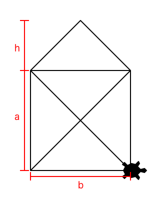

% Exercise Sheet 02 -- Variables, Assignments, and Functions

# Submission

By the end of this sheet you will have a number of different files to submit.
In Stud.IP you will have a directory for your own group, please upload them
there. It is easier for you if you just archive all files and upload your
archive (preferably zip), but it is okay if you upload them one by one.


# Exercise 1: St. Nicholas' living space

We can define St. Nicholas' house by three parameters: side $a$, base $b$, and
roof height $h$. Find a formula to calculate the `area` of the geometrical
figure.

{height=200px}

Now write a script `nick_area.py` to perform the calculations for you. Import
the `random` module. Find a way to generate random numbers between 2 and 5 for
the parameters. You can also try other constraints instead, e.g. the base must
be wider than side $a$ is high. Write a function `area` which takes three input
arguments: `base`, `side`, and `height`, and returns the area of the
geometrical figure.

Test these results first, then use random values:

```python
area1 = area(5, 3, 2)  # should be approx. 20
area2 = area(2, 5, 1)  # should be approx. 11
area3 = area(3, 3, 3)  # should be approx. 13.5
```


# Exercise 2: Castles crashed

During the lecture we learned about the four knights in Castle Crashers and
their epic journey to save princesses. We learned that they have attributes and
can perform attacks. Here is a list of all attributes they really have:

Attribute      Value
-------------- -----
Level ($L$)       31
Strength ($S$)    20
Magic ($M$)       20
Defense ($D$)     30
Agility ($A$)      7

![Castle Crashers, Screenshot [@thebehemoth2012]](http://www.castlecrashers.com/images/screenshots/cc7.jpg){height=200px}

We already created a function `strong_attack_damage(level, strength)` which
calculates the damage of a knight using a strong attack.

```python
def strong_attack_damage(level, strength):
    return (5 + 1.15 * strength + 0.1 * level) // 1
```

Put this function into a script `castle_crashers.py`. Now extend the file to
have more functions to calculate the damage $d$:

`normal_attack_damage(level, strength)`:
  ~ A normal attack follows this damage formula: $d(L, S) = \left\lfloor
  3 + S + 0.1 L \right\rfloor$

`throw_attack_damage(level, strength)`:
  ~ A throw attack means the knight throws around his enemy, damage is: $d(L,
  S) = \left\lfloor 10 + 1.2 S + 0.1 L \right\rfloor$

`maximum_health(level, defense)`:
  ~ A knight has a specific amount of health $h$, which follows this formula:
  $h(L, D) = 69 + 3 L + 28 D$

`arrow_damage(agility)`:
  ~ In case their enemies are far away, the knights can use their bows. The
  damage is rather boring: $d(A) = 2 + A$.

`damage_taken(attack_damage, defense)`:
  ~ In case a knight is hit, they take damage! The health loss $l$ is
  determined like this: $l(d, D) = \left\lfloor d * (1.2 - 0.01 D) + 0.5
  \right\rfloor$


Every now and then two or more knights have to fight for a princess' kiss.
Let's assume today the red knight and the blue knight fight for a princess'
favor. Since they first had to defeat a tough boss, both are weakened already.
The red knight still has 25 % of his maximum health, while the blue knight only
has 20 %.

The older red knight, far more experienced in saving princesses, follows
a specific strategy: While hitting the blue knight he always hits twice with
a strong attack followed by a third normal attack. The dashing young blue
knight simply just flurries with normal attacks, but every 4th time he becomes
super confident and throws the old red knight around. As tradition asks of
them, the older knight is allowed to make the first hit.

The fight thus looks like this:

1. Red attacks Blue with two strong attacks and a normal attack.
2. While red gathers himself after the strong hit he delivered, blue attacks:
   four hits, three normal ones and a throw.
3. Red gets up and attacks blue again with two strong attacks and a normal
   attack.
4. They both keep fighting until one goes down.

If we consider one round as both taking their turn in hitting the other, who
will win? After how many rounds? Add some statements to your script to find
answers.


# References
