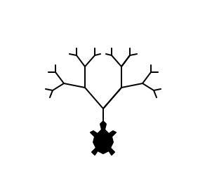
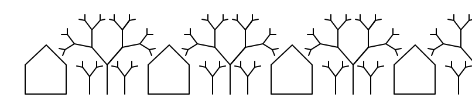
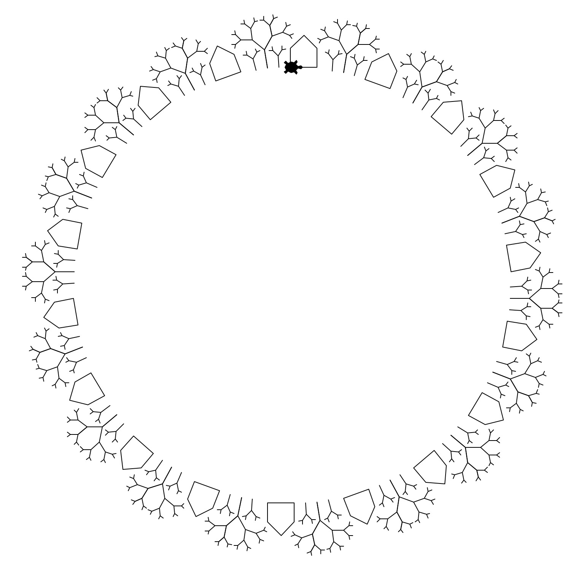

% Exercise Sheet 03 -- `True` or `False`?


# Submission

By the end of this sheet you will have a number of different files to submit.
In Stud.IP you will have a directory for your own group, please upload them
there. It is easier for you if you just archive all files and upload your
archive, but it is okay if you upload them one by one.

# Exercise 1: Fizz Buzz

Fizz Buzz is a simple children's game: Count up the numbers from 1 to N and
whenever a number is divisible by 3 instead of saying the number say `fizz`. If
a number is divisible by 5, say `buzz` instead. If the number is divisible by
3 and 5, say `fizzbuzz`.

Write a script `fizz_buzz.py`. Implement a function `fizz(number)` and
a function `buzz(number)`. The function `fizz` should return `True` iff (= if
and only if) number is divisible by 3. The function `buzz` should return `True`
iff the number is divisible by 5.
Next implement a function `fizz_buzz(to)` which plays a game of Fizz Buzz from 1 up to
number `to` (inclusive). Use the functions `fizz` and `buzz` to test, if a number is
divisible by 3 or 5.


# Exercise 2: N bottles

Similar to `Hello World` programs, `99 bottles` programs give us an idea of how
a programming language looks as they show the basic loop concepts.

The 99 bottles program "sings" a little song which goes like this:

> 99 bottles of beer on the wall, 99 bottles of beer.
> Take one down and pass it around, 98 bottles of beer on the wall.
>
> 98 bottles of beer on the wall, 98 bottles of beer.
> Take one down and pass it around, 97 bottles of beer on the wall.
>
> ...
>
> 1 bottle of beer on the wall, 1 bottle of beer.
> Take one down and pass it around, no more bottles of beer on the wall.

Write a function `n_bottles(n)` in the script `n_bottles.py` which sings the
song starting with `n` bottles instead of 99. If `n` is bigger than 99 or
smaller than 5 print a message that you want to sing a funnier song than `n
bottles` (of course replace `n` with the current `n`). Your final result may
also structure the verses in a different layout.


# Exercise 3: Turtle Drawings

Do you remember the turtle from the first sheet? You drew a Saint Nicholas' house with it. This time we will draw multiple ones -- and some trees in between.

Write a script `turtle_drawing.py`. Develop a function to draw a house (it does not need to be St. Nick's, but you can recycle your code if you like, `draw_house`). Then write a function to draw a tree of a given "height" (`draw_tree(h)`). The height is not only the trees height, but it's branching factor. In fact, your tree should be a fractal, that means it should be a pattern that repeats recursively (Oh oh, recursion is a new concept! But don't worry, it just means that you might need to call a function within itself... the tricky part is to figure out, when to stop; otherwise you would keep calling it forever).



To build the tree follow this little algorithm:

```
To draw a tree with height h:
    If height h is 0, stop.
    Draw a line of length L * h.
    Rotate left by angle A.
    Draw a tree of height h - 1.
    Rotate right by angle 2A.
    Draw a tree of height h - 1.
    Rotate left by angle A.
    Move back to the beginning of the line.
```

The resulting tree should look similar to Figure \ref{fig:tree}. Choose $A$ and $L$ as you like, be creative!

Now draw a simple landscape. Draw a house, a small tree, a big tree, a small tree, and repeat this pattern a couple of times (Figure \ref{fig:flat}). Or build a different one. Just make it repetitive (Yes, use loops).



*Bonuses*: Can you build a round world like in Figure \ref{fig:world}?



