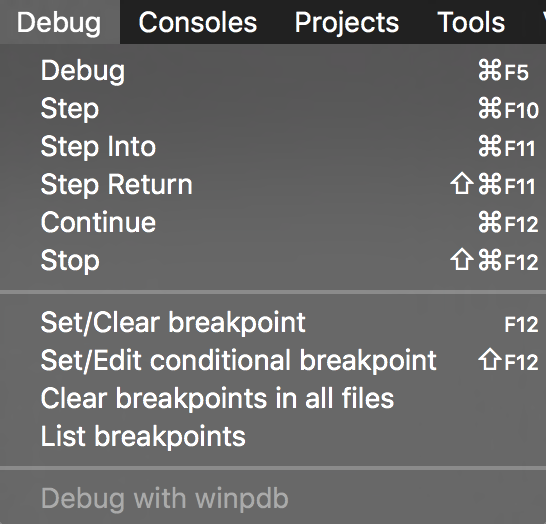

% Handling Errors and Debugging


# General tips and tricks for surviving this class

- Check your [emails](https://sogo.uos.de/) as I don't send Stud.IP messages to
  individuals, only bulk messages. (This is not only useful for this class)
- Try to make your code runnable. It's okay if they have logical errors, but
  after this lecture (if not already) you are able to read `SyntaxError`s.
- Sometimes our solutions might give you valuable hints for how problems can be alternatively solved. Or they hint at the next lecture. Or they just give an opportunity to read other people's code.
- Download the slides. They contain some additional note slides which I usually
  do not present in class. I try to talk about everything but I sometimes
  forget things, so be sure to check them if you solve the homework.


# Homework issues: bitwise operators

What is the difference?

```{ .python .exec }
a = 6
b = 12
print( a == 6 & b == 12 )
print( a == 6 and b == 12 )
print( (a == 6) & (b == 12) )
```

\note{
Long story short: use `and` where possible, only use bitwise `&` if you need it.

Bitwise operators have a stronger binding than `==`, so `6 & b` is evaluated
first. `and` has a weaker binding and is evaluated after `==`.
}


# Homework issues: bitwise `&` (and)

```{ .python .exec }
a = 0b000110  # 6
b = 0b001100  # 12
print(format(a, '06b'), a)
print(format(b, '06b'), b)
print(format(a & b, '06b'), a & b)
```


# Homework issues: bitwise `|` (or)

```{ .python .exec }
a = 0b000110
b = 0b001100
print(format(a, '06b'), a)
print(format(b, '06b'), b)
print(format(a | b, '06b'), a | b)
```

\note{
For completeness for those really interested:

- `>>` shifts all bits to the right, e.g. `4 >> 1 == 2`
- `<<` shifts to the left: `2 << 1 == 4`
- `^` is the exclusive or (XOR): `6 ^ 12 == 10`
- `~` is the negation, which is a little bit confusing as it starts at the
  left-most 1 bit.
}


# Homework issues: File I/O, file mode `w`

- Opening a file for reading should be done with mode `r`.
- If you open a file with `w`, it is cleared.
- If you want to avoid clearing but still write, use `a` for appending.
- Or, if you want read and write, use `r+`.

We will usually work with text files, but if we have binary files (e.g. images)
we might need `b` as an addition to our mode, e.g. `open(filename, 'rb')`.

[Documentation `open()`](https://docs.python.org/3.6/library/functions.html#open)

\note{Intermezzo: slides from session 4}


# Homework issues: absolute versus relative paths

Absolute paths specify files from the root directory:

```{ .changelog }
/Users/shoeffner/Projects/monty/04_CollectionsFileIO/
        code/hangman_words.txt
C:\Users\shoeffner\Documents\Projects\monty\
        04_CollectionsFileIO\code\hangman_words.txt
```

Relative paths specify files relative to the current working directory:

```{ .changelog }
04_CollectionsFileIO/code/hangman_words.txt
hangman_words.txt
```

\note{
You can always assume we have the files in the same directory as the scripts
(unless otherwise mentioned), so just use their names.

Since my script to generate the slides is not too advanced yet, I have to
resort to the slightly longer relative paths as shown on this slide. Sorry for
that, but it makes my life much easier at the moment than fiddling around with
my automation scripts.
}


# Homework issues: relative paths

For this course, always assume files like the `hangman_words.txt` to be in the same directory as your scripts.

Relative paths:

- Start **not** with a `/` or `\ ` or `C:\ `
- May start with `./` or `../`
- Are mostly system independent (i.e. does not contain `shoeffner` or similar things)
- Are portable


# Homework issues: relative paths with \\ and /
```{ .python .exec }
import os
filename = os.path.join('code', 'hangman_words.txt')
print(filename)
```

\note{
For the best portability never use `/` or `\ ` yourself, but resort to the `os.path` module to `join` paths properly.

However, I use `/` in the slides for brevity.
}


# Homework issues: variable naming

Do you understand this?

```{ .python .exec }
def beklemek(ne_kadar=10, nerede='sandalye'):
    numara = 0
    while numara < ne_kadar:
        print(nerede + 'de oturum')
        numara += 1

beklemek(3)
```

\note{
Try to name your variables, write your comments, prints, etc. all in English.

If you want and time allows we can discuss handling different output languages
in a future session. But it's not really important for us.
}


# Homework issues: variable naming

Can you type this code?

```{ .python .exec }
ï = 123
ũ = 4125.23
print(ï, ũ)
```

Where on your keyboard are $\phi$ and $\pi$?

\note{
Even though sometimes math symbols hold a lot of information, try to use
only standard ASCII letters and numbers for your variable names.
}


# Error messages

```{ .python .exec }
print 'Hello World!'
```


# Reading error messages

```{ .changelog }
  File "<stdin>", line 1
    print 'Hello World!'
                       ^
SyntaxError: Missing parentheses in call to 'print'
```

\note{
- `File "<stdin>", line 1`: Location in file
- `print 'Hello World!'`: Faulty line
- `^`: Where in the line?
- `SyntaxError`: Error type
- `Missing parentheses in call to 'print'`: Description
}


# Longer error messages

```{ .python .exec }
def printer():
    print(x)

def caller():
    printer()

caller()
```

\note{
- For nested calls, a Traceback is returned
- From top to bottom you can figure out what was called.
}


# `SyntaxError`: Missing parentheses

```{ .python .exec }
print 'Hello World!'
```


# `SyntaxError`: Missing parentheses

```{ .python .exec}
print('Hello World!')
```


# `SyntaxError`: Invalid Syntax

```{ .python .exec }
print("What is "Python"?")
```


# `SyntaxError`: Invalid Syntax

```{ .python .exec }
print("What is \"Python\"?")
```


# `SyntaxError`: Unexpected character

```{ .python .exec }
print("Are you" + \" + "Monty" + \" + "?")
```

(Unexpected character after line continuation character)

\note{
The line continuation character is `+`.
}


# `SyntaxError`: Unexpected character

```{ .python .exec }
print("Are you \"Monty\"?")
```


# `SyntaxError`: EOL[^eol] while scanning...

```{ .python .exec }
string = "Hello World!
print(string)
```

[^eol]: EOL stands for end of line. Also exists for EOF (end of file).


# `SyntaxError`: EOL while scanning...

```{ .python .exec }
string = "Hello World!"
print(string)
```


# `SyntaxError`: invalid syntax II

```{ .python .exec }
import turtle
turtle.shape('turtle'=
turtle.forward(100)
turtle.right(90)
```


# `SyntaxError`: invalid syntax II

```{ .python }
import turtle
turtle.shape('turtle')
turtle.forward(100)
turtle.right(90)
```


# Summary `SyntaxError`

`SyntaxError`s occur whenever you type something Python can't decipher.
They are found before the code is actually executed.

Most common causes:

- Missing parentheses
- Missing escape characters or quotes
- Typographical errors


# `TypeError`: object is not callable

```{ .python .exec }
import random
my_random_number = random()
print(my_random_number())
```


# `TypeError`: object is not callable

```{ .python .exec }
import random
my_random_number = random.random()
print(my_random_number())
```


# `TypeError`: object is not callable

```{ .python .exec }
import random
my_random_number = random.random()
print(my_random_number)
```


# `TypeError`: must be X, not Y

```{ .python .exec }
x = 10
print('I have ' + x + ' bottles')
```


# `TypeError`: must be X, not Y

```{ .python .exec }
x = 10
print('I have ' + str(x) + ' bottles')
print('I have', x, 'bottles')
```


# `TypeError`: X is not iterable

```{ .python .exec }
numbers = 5
for x in numbers:
    print(x)
```


# `TypeError`: X is not iterable

```{ .python .exec }
numbers = [5]
for x in numbers:
    print(x)
```


#  Summary `TypeError`

`TypeError`s occur whenever you try something with an object it does not support.

Most common causes:

- Calling a module or variable (i.e. putting parentheses behind it)
- Using a dyadic operator on two different types it does not support
- Using non-iterable types as iterables


# Other errors

There is a [full list of built-in Python
errors](https://docs.python.org/3/library/exceptions.html#concrete-exceptions)
in the documentation.

Some important ones you might encounter:

- `IndexError`: You tried to access the wrong elements in a list
- `KeyError`: A dictionary key is not found
- `ZeroDivisionError`: Don't try `1/0`
- `NameError`/`UnboundLocalError`: Something is not yet defined (in the proper scope)

... and many, many more.


# How to deal with errors?

- Read the error message.
- If you have an idea where it's from, try to fix it.
- Search the web: Search for the exception type, check the documentation, etc.
- If you identified the problem: fix it.
- It happens only in one out of 100 iterations? Great, let's check the debugger!

\note{
Despite what everyone tells you: even though there are debuggers (and some of
them are great!), most of the time a simple `print` already reveals your
problems. Just don't forget to delete it again!
}


# Debugging

- A debugger allows to stop code during its execution
- We can inspect variables after each step!


# Interactive Python DeBugger (ipdb)





# Live demo

```{ .python }
def division(x, y):
    return x / y

result = 0
for i in range(16):
    denominator = i - 10
    result += division(i, denominator)
print(result)
```


# Assertions


# Documentation


# Your fifth homework

- We wrote a little script, but it's horribly broken. Try to fix it and add proper documentation.
- Do some simple (very simple!) data analysis on the famous [iris dataset](https://archive.ics.uci.edu/ml/datasets/Iris).

- From now on: Always document your code!

# The last slide

![how I got better at debugging [@evans2016]](http://jvns.ca/images/drawings/better-debugging.png)

