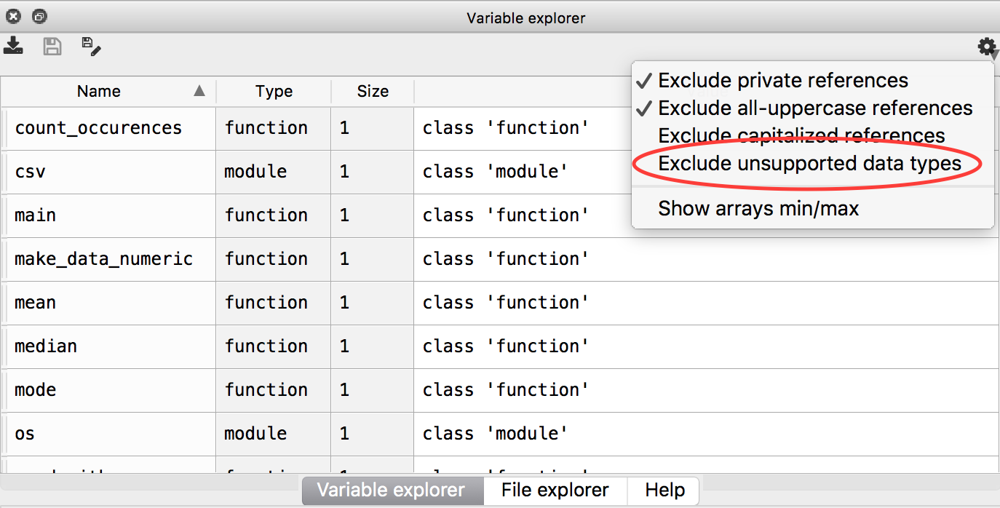

% Python Packages


# Homework issues

- Code written by others is always hard to read
- Usually complex code can't be read "from top to bottom"


# Writing files without simply dumbing the data structures

- Don't just `print([1, 2, 3], file=somefile)`!
- Often libraries (like the `csv` or `json` packages) are better
- Sometimes it's still enough to write a custom solution.
- Be careful of line endings. In general Python handles them correctly if you
  just use `\n`, no matter the OS.

\scriptsize

```{ .python file=05_ErrorsDebugging/code/iris_correction.py }
```

\normalsize


# Try things out

Download the files accompanying the lecture slides to follow along today.
(Also your homework or our solutions from last week.)


# No `matplotlib`. :-(

Even though it was announced off the record last week: We will not use
`matplotlib` just yet. Sorry for that.

Agenda for today:

- Two algorithms (Euclidean algorithm and magic square)
- Python packages and modules

::: notes

Even though it was announced: We will not use `matplotlib` just yet.

Instead I will for the next two weeks or more focus more on programming -- in
Python and in general.

This will, or so I hope, make it much easier for you to use any "library" like
`matplotlib` in the future and make you better programmers even when you don't
use Python for future projects.

:::


# Euclidean algorithm

Given two natural numbers, find their greatest common divisor[^gcd].

It's a simple task for e.g. 12 and 8:

$12 = 12 \cdot 1 = 6 \cdot 2 = 4 \cdot 3 = 3 \cdot 2 \cdot 2$

$8 = 8 \cdot 1 = 4 \cdot 2 = 2 \cdot 2 \cdot 2$

\begin{align}\text{gcd}(12, 8) &= \max\left(\left\{12, 6, 4, 3, 2, 1\right\} \cap \left\{8, 4, 2, 1\right\}\right) \\
                               &= \max\left\{4, 2, 1\right\}\\
                               &= 4\end{align}

Let's try it for 2329 and 2091.

[^gcd]: That is the number which divides both numbers and without remainder, i.e. if $\text{gcd}(a, b) = c$ then $c$ is the maximum value for which holds that $a \mod c = 0$ and $b \mod c = 0$.


# Euclidean algorithm

It's tedious for big numbers to write down all factorizations and compare the sets.

Euclid had a nice idea which can be summarized as follows:

> To find the greatest common divisor (gcd) of two integers, $a$ and $b$, find
> out which one is smaller. Then subtract it from the other one as long as the
> result will be greater than 0. Swap the numbers, as now the other one will be
> smaller and do the same. Continue until you reach 0: the remaining number is
> the gcd.


# Euclidean algorithm

1. $a = 2329, b = 2091$
2. Since $a > b$: $a - b = 2329 - 2091 = 238$. Repeat but use $2091$ and $238$ now.
3. $2091 > 238$: $2091 - 238 = 1851$. Keep going: $1851 - 238 = 1615$. Shortcut: $2091 - (8 \cdot 238) = 187$.
4. $238 > 187$: $238 - 187 = 51$
5. $187 > 51$: $187 - (3 \cdot 51) = 34$
6. $51 - 34 = 17$
7. $34 - 17 = 17$ !
8. Since $17 = 17$, the result is: $17$


# Euclidean algorithm

```{ .python .exec }
def gcd(a, b):
    while a != b:
        if a > b:
            a -= b
        else:
            a, b = b, a
    return a

print(gcd(2329, 2091))
```

::: notes

Do you notice that subtracting $b$ again and again until it would fall below $0$ is nothing else but taking the modulo? Maybe we can improve on that.

:::


# Euclidean algorithm

```{ .python .exec }
def gcd(a, b):
    while b != 0:
        a, b = b, a % b
    return a

print(gcd(2329, 2091))
```

::: notes

`a, b = b, a` is a nice Python feature to swap values.

:::


# Euclidean algorithm -- recursive

\tiny

```{ .python .exec }
def gcd(a, b):
    if b != 0:
        return gcd(b, a % b)
    return a

print(gcd(2329, 2091))
```

```{ .python .exec }
def gcd(a, b):
    return a if not b else gcd(b, a % b)

print(gcd(2329, 2091))
```

\normalsize

::: notes

Do you remember that `0` is evaluated to `False` in Python? So `not b` is essentially the same as `b == 0`.

`a if condition else b` is a conditional expression and evaluates to `a` if the `condition` is `True`, otherwise it becomes `b`. Although it only describes the type of operator *ternary operator* is often used when talking about this specific form of conditional expression.

:::


# Magic squares

This is a magic square of order $n = 3$:

\begin{center}$\begin{pmatrix} 8 & 1 & 6 \\ 3 & 5 & 7 \\ 4 & 9 & 2 \end{pmatrix}$\end{center}

It uses exactly all numbers from $1$ to $n^2$, where $n \times n$ is the size of the square.

All rows, columns and the main diagonals sum up to the same value ($15$).


# Magic squares

We can follow a nice algorithm to construct one for odd orders (i.e. $n = 1$, $n = 3$, ...):

\small

```{ .changelog }
1. Write a $1$ into the middle of the first row.
   That space is now the current space.
2. Test if the upper right neighbor is empty.
    3. If it is: write the next number into that space.
       That space is now the current space.
    4. If it is not: test if the bottom neighbor is empty.
        5. If it is: write next number into that space.
           That space is now the current space.
        6. If it is not: You are done.
7. Continue with step 2.
```

\normalsize


# Magic squares

\scriptsize

```{ .python file=06_Packages/code/lecture/magicsquare.py }
```

\normalsize


# Backtracking

Another way to solve the magic square is backtracking.

Backtracking is a general programming pattern or idiom:

\small

```{ .changelog }
while the problem is not solved:
    for all possible moves:
        if legal move:
            for all possible changes:
                try a change
                call the function recursively
                if call was successful:
                    return True
                else:
                    reset the change
    return False
```

\normalsize

::: notes

It can be applied to many problems: Sudoku solving, mazes (see exercise sheet),
N-queens, ...

:::


# Magic squares with backtracking

\scriptsize

```{ .python }
def magic(square, position, number=1):
    if solved(square):
        return True
    for yoff, xoff in [(-1, 1), (1, 0)]:
        y = (position[0] + yoff) % len(square)
        x = (position[1] + xoff) % len(square[0])
        if square[y][x] == 0:
            square[y][x] = number + 1
            if magic(square, (y, x), number + 1):
                return True
            else:
                square[y][x] = 0
    return False
```

\normalsize

::: notes

Even though this code is much longer than the solution before, I chose it as an easy
to follow example for backtracking.

Note that the initialization now needs to already put the 1 into the first position.

For a complete example, take a look at the accompanying `magicsquare_bt.py`.

:::

# Organizing code

Or: How to write code that others (and my future me) understand?

- use sufficient documentation and comments  `# covered last week`
- use functions  `# also covered`
- use modules  `# now more of this!`


# Documentation and comments

Open spyder, run one of your files, e.g. the `iris_statistics.py`.

Type `help(functionname)` -- you can now see the documentation of that function.


# Function arguments

The `help` function takes a *function* as an argument. Wait, what? A function?

Try:

```{ .python .exec }
def fun():
    return 'Hello'
hello = fun
print(hello())
```

::: notes

- Functions are just *objects* which also have a name, just like variables.
- The difference is that functions are *callable*, that means we can use `function(...)` to execute the code behind it.

:::


# Functions as variables

\small

Spyder hides functions (and modules) in its variable explorer, but we can view them by unchecking *Exclude unsupported data types* in the menu.

\normalsize



::: notes

You can call `help` with any of these! Even with modules!


Those without spyder can use this code to check for what is imported:

`store = set(globals().copy()) | set(('store', ))`
`import ...  # whatever we do in the example ;-)`
`print(set(globals()).difference(store))`

:::


# Import

```{ .python .exec }
import statistics

help(statistics)
```

::: notes

In order to have a function or module available, we need to import it.

:::


# Import

Importing a module means to execute everything "global":

- Function definitions are common
- Statements which are not inside a function
- etc.

::: notes

This is one of the reasons we can think of function names as variables, as the import just "passes them along".

:::


# Python path

\small

We can check our python path, i.e. where python searches for modules:

\scriptsize

```{ .python }
import sys
print(sys.path)
```

```{ .python .hide .exec }
from pprint import pprint as print
import sys
print(sys.path)
```

\normalsize

::: notes

We can import from anywhere inside our python path.

Notice the `''` (empty string) as the first element. That's basically "the
current working directory".

Python searches in all of these from the first to the last for modules you try
to import. As soon as it finds a match, that module is imported.

Of course, on your computers it will look different than what you see here.

:::


# Writing our own modules

\scriptsize

```{ .python file=06_Packages/code/lecture/reader.py }
```

\normalsize

::: notes

This is now a module containing one function.

:::


# Using a module

```{ .python wd=06_Packages/code/lecture .exec file=06_Packages/code/lecture/printer.py }

import reader
data = reader.read_data('example.data')
print(data)
```

::: notes

Using the `import` statement it is possible to employ functions from another
file.

Notice that we used `import reader` and not `import reader.py`! We are only
interested in the name, not in the type.

To call the function, we need to specify the module name and the function
name: The module name is just the name of the Python file: `module.function()`, here `reader.read_data(...)`.

:::


# Reusing a function: directory structure

\scriptsize

```{ .python wd=06_Packages/code/lecture file=06_Packages/code/lecture/printer.py }
```

\normalsize

For this to work, our directory needs to have all files next to each other[^wd]:

\dirtree{%
.1 wd.
.2 reader.py.
.2 printer.py.
.2 example.data.
}

[^wd]: **wd** is the working directory, so where we `cd` to before running the code.


# A more complex directory structure

Consider the following directory tree:

\dirtree{%
.1 wd.
.2 lecture.
.3 reader.py.
.3 printer.py.
.3 example.data.
}

It is possible to `import lecture.reader`.
However, `lecture.printer` does not work! It uses `import reader`.

::: notes

Imports are relative to the current directory or to the directories inside the Python path.

A directory can also be a module if it contains proper Python files, just as `lecture` is here.

:::


# Import failure

\scriptsize

```{ .python .exec wd=06_Packages/code }
import lecture.reader
import lecture.printer
```

\normalsize


# `from ... import ...`

Demo!

\scriptsize

```{ .python wd=06_Packages/code/lecture file=06_Packages/code/lecture/importexamples.py }
```

\normalsize

::: notes

We can already see that modules are bundled into meaningful parts.

The `statistics` modules contains, who would have thought, statistics functions.

The `os` module contains a lot of functions handling information from the
operating system (OS). For some parts there is so much (e.g. path handling)
that it even has some submodules (`os.path`).

:::


# `__init__.py`

To `import lecture` we can add `__init__.py`:
\dirtree{%
.1 wd.
.2 lecture.
.3 \textunderscore{}\textunderscore{}init\textunderscore{}\textunderscore{}.py.
.3 reader.py.
.3 printer.py.
}

```{ .python }
import lecture.reader
import lecture.printer
```

::: notes

We are not able to `import lecture` to gain access to `lecture.reader` or
`lecture.printer`. But for the `os` package this was possible!

If we want to do it properly, we also have to change the `import` statement in
`printer.py`. (But we might have done so anyway two slides ago.)

:::


# `if __name__ == '__main__':`

\scriptsize

Consider these files `a.py`, `b.py`, and `c.py` next to each other.
How often will `python a.py` print "Hello World!", and which ones?


```{ .python file=06_Packages/code/lecture/a.py }
```

```{ .python file=06_Packages/code/lecture/b.py }
```

```{ .python file=06_Packages/code/lecture/c.py }
```

\normalsize


# `if __name__ == '__main__':`

```{ .python file=06_Packages/code/lecture/a.py wd=06_Packages/code/lecture .exec }
```

::: notes

Explanation:

- a imports b.
- During b's import, b in turn imports c.
- c declares a function and prints "Hello World! c"
- b, finishing c's import, can now print "Hello World! b"
- a can now import c -- since b already did that, python does not execute c again.
- a prints "Hello World! a"

:::


# `if __name__ == '__main__':`

If `b` and `c` were modules written by other programmers, would we expect them to print something during the import?

Most likely not.


# `if __name__ == '__main__':`

Each module gets a magic name. It's accessible via the variable `__name__`.

\scriptsize

```{ .python .exec wd=06_Packages/code/lecture}
import os
import statistics
import reader  # the file we wrote before
print('os name:', os.__name__)
print('statistics name:', statistics.__name__)
print('reader name:', reader.__name__)
print('this name:', __name__)
```

::: notes

Notice that the file we execute gets the name `__main__`.

We can use this for a nice trick!

:::


# `if __name__ == '__main__':`

\scriptsize

```{ .python file=06_Packages/code/lecture/ifmain/mymath.py }
```

\normalsize

```{ .python wd=06_Packages/code/lecture/ifmain .exec }
import mymath
print(mymath.add(32, 453))
```

::: notes

Since the `__name__` variable will be `__main__` for the script we use, we can
put everything which should not be executed into an if-block.

:::


# `if __name__ == '__main__':`

\scriptsize

```{ .python file=06_Packages/code/lecture/ifmain/mymath.py .exec }
```

\normalsize


# Packages

\small

A bundle of several modules is usually called a package.

\normalsize

 -- the Python package Index](img/pypi.png){ height=150px }

::: notes

While there are lots of packages (> 100,000) online available, many of them are very specific.

We will mostly work with the core library, as it already has many cool things.

:::


# Your sixth homework

- Solve a maze by backtracking.

\dirtree{%
.1 hw6.
.2 mazesolver.
.3 io.py.
.3 solver.py.
.2 solve\textunderscore{}maze.py.
}


# The last slide

![Sally Forth [@marciuliano2013]](https://safr.kingfeatures.com/idn/cnfeed/zone/js/content.php?file=aHR0cDovL3NhZnIua2luZ2ZlYXR1cmVzLmNvbS9TYWxseUZvcnRoLzIwMTMvMTAvU2FsbHlfRm9ydGguMjAxMzEwMjRfOTAwLmdpZg==)


# References
