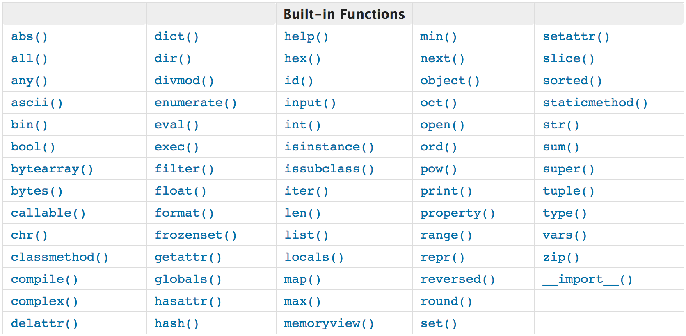

% Practical Python


# Built-in functions for your everyday tasks

We already discussed some [built-in
functions](https://docs.python.org/3/library/functions.html), for example:

- `open`: Opens a file
- `str`, `float`, `int`: Casts data to the respective types
- `range`: Generates a sequence of numbers
- `enumerate`: Gives us indices and items for iterations
- `set`, `list`, `tuple`, `dict`: Create the corresponding collections


# Built-in functions

![Built-in Functions. [@pythondocs]](img/builtin_overview.png)


# Built-in functions

![Green: You know these. Orange: Cover these on your own. Red: Today! Blue: Future sessions. Grey: We won't need these. [@pythondocs]](img/builtin_overview_marked.png)


# Homework issues: `__repr__`

```{ .python .exec }
class Car:
    def __init__(self, color):
        self.color = color

    def __str__(self):
        return self.color + ' car'

cars = [Car(c) for c in ('blue', 'red', 'yellow')]
print(cars)
```

\note{
The print functions tries to call `__str__` for all objects you give it.
Here, the object is a list! The list's `__str__` function calls its elements'
`__repr__` functions.
}


# Homework issues: `__repr__`

`__repr__` should return a string which can be used to create an object which is similar:

```{ .python .exec }
class Car:
    def __init__(self, color):
        self.color = color

    def __str__(self):
        return self.color + ' car'

    def __repr__(self):
        return 'Car("' + self.color + '")'

cars = [Car(c) for c in ('blue', 'red', 'yellow')]
print(cars)
```


# Homework issues: x is not `callable`

A variable is callable if it is for example a function:

```{ .python .exec }
number = 5
fun = sum
class Car:
    pass

print('number is callable:', callable(number))
print('fun is callable:', callable(fun))
print('Car is callable:', callable(Car))
```

Why is `Car` callable?

\note{
`Car` is callable since calling a class (`Car()`) is creating a new instance.
}

# Homework issues: `*` (tuple unpacking)

```{ .python .exec }
def add(a, b):
    return a + b

print(add(*[1, 2]))
```

`add(*[1, 2])` is equivalent to `add(1, 2)` -- Python "unpacks" the values into
each function argument.


# General questions: `if __name__ == '__main__':`

- Modules have `__name__`s, the one you run `__main__`, others their file or
  directory names (without `.py`).
- `import` executes files
- To avoid random prints etc. on import, "secure" your code in `if` block:
    * `if __name__ == '__main__':`
- For extra karma you can put every code in that block into a function (usually `main`):
    * `def main():`
    * Call `main` inside the `if` block
    * This avoids global scope *pollution*


# Find the lowest number

```{ .python }
vacation_offers = [1023.43, 983.4, 985.12, 1014.52]
```


# Find the lowest number

```{ .python .exec }
vacation_offers = [1023.43, 983.4, 985.12, 1014.52]
low = float('inf')
for offer in vacation_offers:
    if offer < low:
        low = offer
print(low)
```


# Find the highest number

```{ .python .exec }
vacation_offers = [1023.43, 983.4, 985.12, 1014.52]
high = -float('inf')
for offer in vacation_offers:
    if offer > high:
        high = offer
print(high)
```


# Python can do it already!

```{ .python .exec }
vacation_offers = [1023.43, 983.4, 985.12, 1014.52]
print(min(vacation_offers))
print(max(vacation_offers))
```


# Any & All

```{ .python }
none_true = [False, False, False, False]
some_true = [True, False, True, False]
all_true = [True, True, True, True]
```

\note{
A very common operation is to check if some values fulfill some condition, all
match it, or none.

Later we will see how we can easily create lists of boolean values like the
ones above.
}


# Any & All

\scriptsize

```{ .python }
none_true = [False, False, False, False]
some_true = [True, False, True, False]
all_true = [True, True, True, True]

def any_true(tocheck):
    for elem in tocheck:
        if elem:
            return True
    return False

def all_true(tocheck):
    for elem in tocheck:
        if not elem:
            return False
    return True

print('Any in none?', any_true(none_true))
print('Any in some?', any_true(some_true))
print('All in some?', all_true(some_true))
print('All in all?', all_true(all_true))
```

\normalsize


# Any & All

```{ .python }
none_true = [False, False, False, False]
some_true = [True, False, True, False]
all_true = [True, True, True, True]

print('Any in none?', any(none_true))
print('Any in some?', any(some_true))
print('All in some?', all(some_true))
print('All in all?', all(all_true))
```


# Sorting in Python

```{ .python .exec }
sorted_list = sorted([9, 2, 5, 3, 1, 8, 19])
print(sorted_list)
sorted_list = sorted([9, 2, 5, 3, 1, 8, 19], reverse=True)
print(sorted_list)
```


# Sorting by key

```{ .python .exec }
def get_age(item):
    return item['age']

unsorted_dicts = [{'age': 23}, {'age': 25}, {'age': 21}]
sorted_dicts = sorted(unsorted_dicts, key=get_age)
print(sorted_dicts)
```

\note{
If you attempted the difficult bonus exercise last week, you already saw how to
use a key function. Now we will shed some light into it.
}


# Passing functions around

\scriptsize

```{ .python .exec }
def shout():
    print('HELLO!')

def whisper():
    print('hello...')

def do_something(what):
    what()

do_something(whisper)
do_something(shout)
```

\normalsize

\note{
Python always passes by *object reference*. For some objects, those which are
mutable, this means that we get references to those objects which we can use
and modify. For others, like integers and strings (which are immutable) they
get copied themselves.
}


# Mutable objects

```{ .python .exec }
def mutate(some_list):
    some_list.append(1)

my_list = []
mutate(my_list)
mutate(my_list)
print(my_list)
```


# No reassignment possible

```{ .python .exec }
def cantreassign(some_list)
    some_list = [1, 2, 3]

my_list = []
cantreassign(my_list)
print(my_list)
```


# Using function objects: `map` and `filter`

Python has two interesting functions: `map` and `filter`

Both take two arguments: A function, and an iterable (e.g. a list, a string,
...)


# `map`

`map` calls the passed function on each element and stores the results into
a `map` object. This can be transformed into a list:

```{ .python .exec }
def square(x):
    return x * x

in_list = [1, 2, 3, 4, 5]
out_list = list(map(square, in_list))
print(out_list)
```


# `filter`

`filter` calls the passed function on each element and stores those elements,
for which the result is not `False`, into a `filter` object. This can be
transformed into a list.

```{ .python .exec }
def is_even(x):
    return not x & 1

in_list = [1, 2, 3, 4, 5]
out_list = list(filter(is_even, in_list))
print(out_list)
```


# `map` and `filter`

Chaining is possible (even without explicit list conversions in between):

```{ .python .exec }
def is_even(x):
    return not x & 1

def square(x):
    return x * x

in_list = [1, 2, 3, 4, 5]
out_list = list(map(square, filter(is_even, in_list)))
print(out_list)
```


# Using function objects: Comparison to lists

```{ .python .exec }
def is_even(x): return not x & 1

def square(x): return x * x

in_list = [1, 2, 3, 4, 5]
out_list = list(map(square, filter(is_even, in_list)))
# is equivalent to
acc_list = []
for x in in_list:
    if is_even(x):
        acc_list.append(square(x))

print(out_list)
print(acc_list)
```

\note{
Don't write functions like this, I just save some space.
}


# Using function objects: Comparison to list comprehensions

```{ .python .exec }
def is_even(x): return not x & 1

def square(x): return x * x

in_list = [1, 2, 3, 4, 5]
out_list = list(map(square, filter(is_even, in_list)))
# is equivalent to
acc_list = [square(x) for x in in_list if is_even(x)]

print(out_list)
print(acc_list)
```


\note{
You can read up a little bit more about how to unroll list comprehensions here:
https://docs.python.org/3/tutorial/datastructures.html#list-comprehensions

Take a look at the for loop inside the for loop for a hint for the homework ;-)
}


# lambdas

TODO


# `zip`

One powerful and yet a little bit difficult to grasp functions is `zip`.

Imagine a zipper:

TODO


# `dir`

TODO


# Your eighth homework


# The last slide




# References
