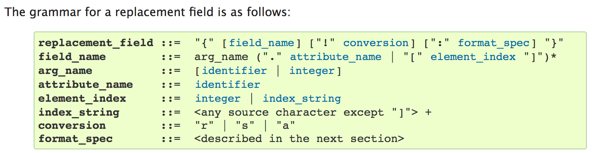

% Errors and Finite State Machines


# Quick homework issues

- Don't write your own sorting algorithms, just use what is their
- Don't remove all print statements -- we do expect *some* output ;-)
- Try to structure your code using functions


# Homework issues: Changing attributes

```{ .python }
def comfort_evaluation(car):
    if car.seats == 2:
        car.seats = 1
    elif car.seats == 'more':
        car.seats = 2
    ...
    return car.seats + car.luggage + car.doors
```

What happens if we call the function twice for the same car which had `'more'` seats?

\note{
Don't change values if you just want to read them! Sometimes you want to use them somewhere else, or someone else wrote some code where it's still important to have `'more'`.

In this example on the first evaluation, `car.seats` would be set to 2, on the second it would then be set to 1!
}


# Mutability

```{ .python .exec }
def do(l):
    l[0] = 3

l = [1, 2, 3]
do(l)
print(l)
```

For some more explanations and examples, check [Immutable vs Mutable types](https://stackoverflow.com/q/8056130/3004221).

\note{
- Lists and objects are mutable, that means they can be modified inside
  functions unless you copy them.
- int, str, float, etc. are not mutable (immutable), they always stay what they
  were before the function call.
}


# Handling exceptions

We discussed:

* documentation
* asserts
* debugging

\note{
While most (maybe even all?) errors are called `Error`, you will find me calling them *exceptions*.

Correct would be to call `SyntaxError`s errors and most other errors exceptions.

But since there is no clear distinction between the two, I try to use *exception* on all slides.
}


# Expected exceptions

Sometimes exceptions are expected to happen. Be prepared!

```{ .python }
number = None
while not number:
    value = input('Please enter a number > 0: ')
    number = float(value)
```

What if someone enters a name (and not a number)?


# Try and except exceptions

```{ .python }
number = None
while not number:
    value = input('Please enter a number > 0: ')
    try:
        number = float(value)
    except ValueError as value_error:
        print('Error:', value_error)
```

*Output*:

```{ .changelog }
Please enter a number > 0: Basti
Error: could not convert string to float: 'Basti'
Please enter a number > 0: 0
Please enter a number > 0: 1
```

\note{
`try` runs code until an exception occurs. If that exception was expected, we can catch it with `except`.

Otherwise the program will crash, just as you have seen it many times with exceptions.
}


# Multiple exceptions

Sometimes you want to except multiple exceptions.

There are three ways to do this:

* Excepting all exceptions at once
* Excepting all individually
* A combination thereof


# Excepting multiple exceptions at once

```{ .python }
halogens = {9: 'F', 17: 'Cl',
            35: 'Br', 53: 'I',
            85: 'At'}
number = None
while number not in halogens.keys():
    try:
        number = int(input('Please enter an atomic number: '))
        print('You selected', halogens[number])
    except (ValueError, KeyError) as error:
        print('Sorry!', error)
```


# Excepting multiple exceptions individually

```{ .python }
halogens = {9: 'F', 17: 'Cl',
            35: 'Br', 53: 'I',
            85: 'At'}
number = None
while number not in halogens.keys():
    try:
        number = int(input('Please enter an atomic number: '))
        print('You selected', halogens[number])
    except ValueError as error:
        print('No number', error)
    except KeyError as error:
        print('Key not found', error)
```


# To handle or not to handle?

Which errors should be handled, which ones not?


# To handle

- `KeyError`
- `ValueError`
- `ZeroDivisionError`
- `IndexError`
- and many more


# Not to handle

- `SyntaxError`
- `IndentationError`
- `OutOfMemoryError`
- `RecursionError`
- and many more

\note{
You should never handle exceptions which occur because of the code syntax, nor should you handle exceptions which denote system limitations.

Rule of thumb: Handle only what you can handle with an algorithm.
}


# Finally

\scriptsize

```{ .python .exec }
def read(filename):
    print('Opening')
    handle = open(filename)
    try:
        print('Reading')
        return handle.read().splitlines()
    finally:
        print('Closing')
        handle.close()

read('Makefile')
```

\normalsize

\note{
Statements inside a finally block will always be executed, regardless of
exceptions before or not.

It even works after returns!

It is most commonly used to ensure files and other connections are closed. But
beware: `with` is almost always better!
}


# Finally

\tiny

Exception:
```{ .python .exec }
try:
    a = int('abc')
except ValueError:
    a = -1
finally:
    print('Finally!')
print(a)
```

No exception:
```{ .python .exec }
try:
    a = int('1')
except ValueError:
    a = -1
finally:
    print('Finally!')
print(a)
```

\normalsize


# Raising your own exceptions

\scriptsize

```{ .python .exec }
class CarException(Exception): pass

class Car:
    def __init__(self, broken=False):
        self.broken = broken

    def drive(self):
        if self.broken:
            raise CarException('Broken cars do not drive!')
        print('Driving!')

for car in [Car(), Car(True)]:
    try:
        car.drive()
    except CarException as ce:
        print(ce)
```

\normalsize

\note{
`class CarException(Exception)` means that the class `CarException` *inherits*
all properties the class `Exception` has. We won't discuss inheritance in more
details. But it is important so that you can `raise` exceptions.

The string in the exception you raise should be meaningful: It's the error
message other people will see.
}


# Use cases for exception handling

When writing your own programs, you will mostly have to deal with exceptions when facing user input.

But there are other situations: Reading files, downloading data, program interruptions, ...


# Combining strings and numbers

A common pattern we used so far:

\scriptsize

```{ .python .exec }
wheels = 4
description = 'My car has ' + wheels + ' wheels.'
print(description)
```

```{ .python .exec }
wheels = 4
description = 'My car has ' + str(wheels) + ' wheels.'
print(description)
```

\normalsize

\note{
Casting things to strings manually is very tedious. There's a better way!
}


# Format strings

```{ .python .exec }
wheels = 4
description = 'My car has {} wheels.'
print(description.format(wheels))

print('My car has {wheels}.'.format(wheels=6))
```

\note{
The `{}` are delimiters. Here they just serve as placeholders, but we can do
much more with them. Notice the `wheels` in the second case? It allows to name
an argument.

Consider: `'I am at ({x}, {y})'.format(y=2, x=5)`.
}


# Format strings are a powerful tool

```{ .python .exec }
print('{:.3}'.format(1/3))
print('{:0>8.3}'.format(4/3))
print('{:*^25}'.format('Hello'))
```

\note{
The `:` means: now comes a format rule!
The format rules then follow a special syntax. The examples here go as follows:

- `.3` Format with 3 decimal places ("After decimal separator, use up to 3 digits").
- `0>8.3` Pad with `0`s (put zeros to fill the width), align right (`>`), make it `8` characters long (at least), and have `3` after the decimal separator. Note that 8 is the *total* length, so there will be $8-3-1$ characters (or more if needed) left of the `.`.
- `*^25` Pad with `*`s, align centered (`^`), make it `25` wide.
}


# Format specifications



\note{
Now you can create output which looks like you want without having to weirdly
concatenate strings and check spaces, etc.

There is much more inside the documentation, we will take a look at some of it
now.
}


# Paradigm shift

We have now learned a huge set of tools in Python:

\small

Variables, functions, classes, numbers, strings, error handling, documentation,
lists, dictionaries, sets, tuples, some built-in functions, lambdas, list
comprehensions, mathematical operations, directory structures, imports, naming
and code conventions, input and output, loops, if and else, ...

\normalsize

If you want to go into more details about all those things, I recommend the
[Python Tutorial](https://docs.python.org/3/tutorial/). It covers what we did
and sometimes a little bit more.

For the rest of the course, we will mostly focus on applications.


# Finite State Machines (FSM/FSA)

- Abstract machines
- Can decide (acceptors/classifiers) or produce output (transductors)
- Have a finite number of distinct states
- Can perform state transitions to change state
    * They can be deterministic or non-deterministic
- Here: focus on *deterministic acceptors*[^dfa]

[^dfa]: Deterministic Finite Automaton (DFA)

\note{
- Sometimes called *Finite State Automaton* (FSA)
- The formal things now will be a little bit boring for people following the
  Computer Science D class by Prof. Chimani or the Computational Linguistics
  class by Dr. phil. Gregoromichelaki, but we will make some more practical
  considerations.
- You can already guess: This is a cool link to other subjects!
}


# DFA and formal languages

- DFA decides if a word $w$ is possible in formal language $\mathcal{L}$
- $\mathcal{L}$ is defined over alphabet $\Sigma$ like this: $\mathcal{L} \subseteq \Sigma^*$
- $\mathcal{L}$ is described by a set of rules
- DFA checks if $w$ follows rule set or not


\note{
- $\Sigma$ can be something like $\{a, b\}$
- $\Sigma^*$ is then the set of all possible combinations of $a$ and $b$ and
  the empty set $\emptyset$
- Examples are: $aaababb$, $a$, $\emptyset$, $bbbb$, $ab$, ...
}


# The formal language "Python binaries"

The formal language "Python binaries" $\mathcal{L}_{pb}$ is defined over the
alphabet $\Sigma = \{0, 1, b\}$. It has the following rules:

1. The empty word ($\emptyset$) is not part of $\mathcal{L}_{pb}$.
1. Each word must start with $0b$.
1. After $b$, a $1$ or a $0$ must follow.
1. After any $1$ or $0$ (not the first), there may follow another $1$ or
   $0$.

Considering the rules above. Which of these words are part of $\mathcal{L}_{pb}$?

a. $w_0 = 0b001101$
b. $w_1 = 0b110$
c. $w_2 = 01110011$
d. $w_3$ = $b0b101b$
e. $w_4 = 0b0000011$
f. $w_5 = 0b$

\note{
Valid: $w_0, w_1, w_4$.

Invalid: $w_2$ (no $b$), $w_3$ (too many $b$), $w_5$ (no $0$ or $1$ after $b$).
}


# DFA for "Python binaries"

A DFA $\mathcal{A}$ is a quintuple[^wtf]:

$\mathcal{A} = \left(\Sigma, S, S_0 \in S, \delta : S \times \Sigma \rightarrow S, G \subseteq S\right)$

with:

- $\Sigma$: the input alphabet, here $\Sigma = \{ 0, 1, b \}$
- $S$: the set of states, we discuss this on the next slide
- $S_0 \in S$: the start state, also next slide
- $\delta$: the transition function which describes when to move where
- $G$: the set of goal states, if these are reached, the DFA accepts

[^wtf]: No worries, it's not that hard!


# Drawing a DFA as a directed graph

\begin{center}
\begin{tikzpicture}[->,>=stealth,shorten >=1pt,auto,node distance=2.8cm,
                    semithick]
    \node[initial,state]   (A)              {A};
    \node[state]           (B) [right of=A] {B};
    \node[state]           (C) [right of=B] {C};
    \node[state,accepting] (D) [right of=C] {D};

    \path (A) edge              node {0} (B)
          (B) edge              node {b} (C)
          (C) edge              node {0, 1} (D)
          (D) edge [loop above] node {0, 1} (D)
          ;
\end{tikzpicture}
\end{center}

We can now identify our states easily:

- $S = \{A, B, C, D\}$
- $S_0 = A$
- $G = \{D\}$


# Creating a grammar

\begin{center}
\begin{tikzpicture}[->,>=stealth,shorten >=1pt,auto,node distance=2.8cm,
                    semithick]
    \node[initial,state]   (A)              {A};
    \node[state]           (B) [right of=A] {B};
    \node[state]           (C) [right of=B] {C};
    \node[state,accepting] (D) [right of=C] {D};

    \path (A) edge              node {0} (B)
          (B) edge              node {b} (C)
          (C) edge              node {0, 1} (D)
          (D) edge [loop above] node {0, 1} (D)
          ;
\end{tikzpicture}
\end{center}

**Grammar:**
\vspace{-3em}
\begin{align*} A &\rightarrow 0B \\
    B &\rightarrow bC \\
    C &\rightarrow 0D\, |\, 1D \\
    D &\rightarrow 0D\, |\, 1D\, |\, \epsilon
\end{align*}

\note{
A $|$ denotes an `or`, $\epsilon$ means no input. Rules can either be of the
form $S \rightarrow \sigma \in \Sigma \times S$, $S \rightarrow \sigma \in
\Sigma$, or $S \rightarrow \epsilon$. The last two rules, which don't have new
states defined, are called "terminal" rule.

There are also many algorithms to convert between grammars, diagrams, rules,
etc.; the problems we discuss are usually easily solved by "looking closely".
}


# Writing a transition function

\scriptsize

\begin{center}
\begin{tikzpicture}[->,>=stealth,shorten >=1pt,auto,node distance=2.8cm,
                    semithick]
    \node[initial,state]   (A)              {A};
    \node[state]           (B) [right of=A] {B};
    \node[state]           (C) [right of=B] {C};
    \node[state,accepting] (D) [right of=C] {D};

    \path (A) edge              node {0} (B)
          (B) edge              node {b} (C)
          (C) edge              node {0, 1} (D)
          (D) edge [loop above] node {0, 1} (D)
          ;
\end{tikzpicture}
\end{center}

**Grammar:**
\vspace{-3em}
\begin{align*} A &\rightarrow 0B \\
    B &\rightarrow bC \\
    C &\rightarrow 0D\, |\, 1D \\
    D &\rightarrow 0D\, |\, 1D\, |\, \epsilon
\end{align*}

\scriptsize

**Transition function:**

$\delta$ b 0 1
-------- - - -
A        ? B ?
B        C ? ?
C        ? D D
D        ? D D

\normalsize

\note{
You can read the transfer function like this:

Given a state (first column) and an input (first row), the state changes to the
state which is defined if we take state and input as coordinates.
For example, given state $B$ and input $0$, the next state would be $C$. State
$A$ and input $b$ result in state $B$. And so on. Formally each cell defines
a rule of the form $S \times \Sigma \rightarrow S$, e.g. $B \times
b \rightarrow C$ and $C \times 0 \rightarrow D$.

What about the question marks?
}


# Implicit error states

\scriptsize

*Solution*: Add another state

$\delta$      b             0             1
------------- ------------- ------------- -------------
A             \color{cyan}E B             \color{cyan}E
B             C             \color{cyan}E \color{cyan}E
C             \color{cyan}E D             D
D             \color{cyan}E D             D
\color{cyan}E \color{cyan}E \color{cyan}E \color{cyan}E

$E$ is the implicit error state. It is difficult to imagine it in a grammar as
it would not have a nice terminal rule (a single element of $\Sigma$), but we
can nicely draw it:

\begin{center}
\begin{tikzpicture}[->,>=stealth,shorten >=1pt,auto,node distance=2.8cm,
                    semithick]
    \node[initial,state]   (A)              {A};
    \node[state]           (B) [right of=A] {B};
    \node[state]           (C) [right of=B] {C};
    \node[state,accepting] (D) [right of=C] {D};
    \node[state]           (E) [node distance=1cm, below of=C] {\color{cyan}E};

    \path (A) edge              node {0} (B)
              edge [bend right] node {1, b} (E)
          (B) edge              node {b} (C)
              edge [bend right] node {0, 1} (E)
          (C) edge              node {0, 1} (D)
              edge              node {b} (E)
          (D) edge [loop right] node {0, 1} (D)
              edge [bend left]  node {b} (E)
          ;
\end{tikzpicture}
\end{center}

\normalsize

\note{
The implicit error state is useful when we program our FSA.

To find out what leads to error state, imagine all possible inputs for each
state: Those which are not "legal" according to the grammar rules lead to the
error state (sometimes called "trap").
}


# Implementing $\delta$

\tiny

$\delta$ b 0 1
-------- - - -
A        E B E
B        C E E
C        E D D
D        E D D
E        E E E

```{ .python .exec }
def delta(state, letter):
    states, inputs = ['A', 'B', 'C', 'D', 'E'], ['b', '0', '1']
    transition = [
        ['E', 'B', 'E'],
        ['C', 'E', 'E'],
        ['E', 'D', 'D'],
        ['E', 'D', 'D'],
        ['E', 'E', 'E']
    ]
    return transition[states.index(state)][inputs.index(letter)]

print('A x b -> {}'.format(delta('A', 'b')))
print('A x 0 -> {}'.format(delta('A', '0')))
print('C x 1 -> {}'.format(delta('C', '1')))
```

\normalsize


# Implementing a DFA

\tiny

```{ .python .exec file=09_ErrorsFSM/code/binary.py }
```

\normalsize


# Checking our examples

```{ .python .exec wd=09_ErrorsFSM/code }
import binary  # The file from last slide

for b in ['0b001101', '0b110', '01110011',
          'b0b101b', '0b0000011', '0b']:
    print('{} {}'.format(b, binary.fsa(b)))
```


# Where do we find DFA?

Where do you think do we find DFA?


# Where do we find DFA?

- coin vending machines
- programming (remember the string format syntax?)
- cars (e.g. wiper motors)
- process descriptions
- ...


# Your ninth homework

- Coffee machines are also some automaton. Help us to decide which "recipes"
  work best for our coffee!

