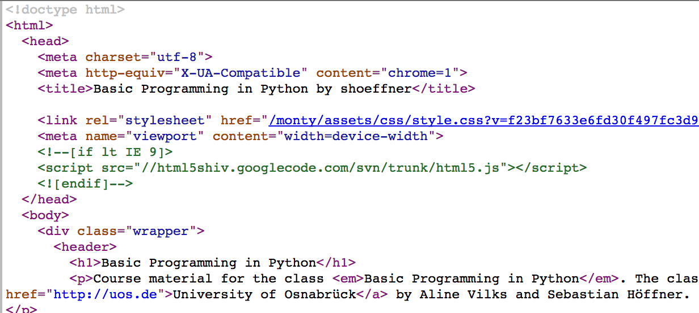

% Regular Expressions and HTTP


# Matching strings: "Python binaries"

\begin{center}
\begin{tikzpicture}[->,>=stealth,shorten >=1pt,auto,node distance=2.8cm,
                    semithick]
    \node[initial,state]   (A)              {A};
    \node[state]           (B) [right of=A] {B};
    \node[state]           (C) [right of=B] {C};
    \node[state,accepting] (D) [right of=C] {D};
    \node[state]           (E) [node distance=2cm, below of=C] {E};

    \path (A) edge              node {0} (B)
              edge [bend right] node {1, b} (E)
          (B) edge              node {b} (C)
              edge [bend right] node {0, 1} (E)
          (C) edge              node {0, 1} (D)
              edge              node {b} (E)
          (D) edge [loop above] node {0, 1} (D)
              edge [bend left]  node {b} (E)
          (E) edge [loop below] node {0, 1, b} (E)
          ;
\end{tikzpicture}
\end{center}

\note{
Last week we discussed the formal language "Python binaries" and how to check strings if they are part of it.

Today we learn a powerful tool to not only check if a string matches a certain
grammar (i.e. is part of a formal language), but also to find all matching
sequences inside long texts: Regular expressions.
}


# Regular Expressions (regex)

- Regex are often called *patterns*
- Regex were designed to match regular languages[^reglang]
- Regex can also be used to search long texts for patterns
- Regex are built-in into many text editors and programming languages
- Regex are transformed into an FSA just like we implemented last week

[^reglang]: Basically those we can represent using the FSA we learned, for more
info check https://en.wikipedia.org/wiki/Chomsky_hierarchy or join the
theoretical computer science class.


# Formal definition of regular languages[^srcwikilang]

Regular languages over $\Sigma$ are:

- Empty language $\emptyset$, empty string language $\{\epsilon\}$
- Singleton languages ($\left\{a\right\}$ if $a \in \Sigma$)
- Union, concatenation and Kleene star of languages $A$ and $B$

[^srcwikilang]: Adapted from @wiki2017reglang


# Regex in Python

`re` module allows to use regular expressions[^redocs]:

```{ .python }
import re
re.fullmatch(pattern, string)  # Complete string
```

[^redocs]: https://docs.python.org/3/library/re.html

\note{
The `re` module has many more elements to form a regular expression than what
we will cover here, if you feel like it, feel free to explore it more for your
own projects.

We will only discuss the procedural interface, but there is also an object
oriented interface where you *compile* a regex and perform actions on it:

`regex = re.compile(pattern)`
`regex.fullmatch(string)`

The compiled version can also be used like this: `re.fullmatch(regex, string)`.
This is faster if you want to reuse the same regex multiple times.
}


# Regex: empty string

Regular expression for the empty language is the empty string.

```{ .python .exec }
import re
nonempty = re.fullmatch('', 'This is a string.')
empty = re.fullmatch('', '')

print(nonempty)
print(empty)
```

\note{
The empty string only matches the empty string.
}


# Regex: Singleton languages

\scriptsize

```{ .python .exec }
import re
nomatch = re.fullmatch('a', 'aaa')
nomatch2 = re.fullmatch('a', 'ababa')
match = re.fullmatch('a', 'a')

print(nomatch)
print(nomatch2)
print(match)
print(match[0])
```

\normalsize

\note{
A singleton pattern matches single letters which are the same.

**Reading the result**:

`a`: `<_sre.SRE_Match object; span=(0, 1), match='a'>`

span:
~ from where to where (`a.pos`, `a.endpos`)

match:
~ what was matched (here the input string)

Using the indexing, we can access groups (more later), the first group (0) is the match.
}


# Regex: Concatenation

```{ .python .exec }
import re
nomatch = re.fullmatch('ab', 'a')
match = re.fullmatch('ab', 'ab')

print(nomatch)
print(match[0])
```

\note{
We can just concatenate (i.e. append to teach other) patterns to match their
concatenation.
The pattern `a` matches `a`, the pattern `b` matches `b`, but pattern `ab` only
matches `ab` and neither `a` nor `b`.
}


# Intermezzo: Set theory meets logic

**Two sets, $A$ and $B$**

\begin{center}
    \begin{tikzpicture}
        \draw (0,0) circle (1.5cm) node {$A$};
        \draw (2,0) circle (1.5cm) node {$B$};
    \end{tikzpicture}
\end{center}


# Intermezzo: Set theory meets logic

**Only set $A$**

\begin{center}
    \begin{tikzpicture}
        \fill[orange] (0,0) circle (1.5cm);
        \draw (0,0) circle (1.5cm) node {$A$};
        \draw (2,0) circle (1.5cm) node {$B$};
    \end{tikzpicture}
\end{center}


# Intermezzo: Set theory meets logic

**Sets $A \cap B$**

\begin{center}
    \begin{tikzpicture}
        \begin{scope}
        \clip (0,0) circle (1.5cm);
        \fill[orange] (2,0) circle (1.5cm);
        \end{scope}
        \draw (0,0) circle (1.5cm) node {$A$};
        \draw (2,0) circle (1.5cm) node {$B$};
    \end{tikzpicture}
\end{center}

 $A$   $B$   $A \wedge B$
----- ----- --------------
  1     1         1
  1     0         0
  0     1         0
  0     0         0

\note{
Intersection is like the logical *and*. Notice the similarity between the symbols $\cap$ and $\wedge$!
}


# Intermezzo: Set theory meets logic

**Sets $A \cup B$**

\begin{center}
    \begin{tikzpicture}
        \fill[orange] (0,0) circle (1.5cm);
        \fill[orange] (2,0) circle (1.5cm);
        \draw (0,0) circle (1.5cm) node {$A$};
        \draw (2,0) circle (1.5cm) node {$B$};
    \end{tikzpicture}
\end{center}

 $A$   $B$   $A \vee B$
----- ----- --------------
  1     1         1
  1     0         1
  0     1         1
  0     0         0

\note{
Union is like the logical *or*. Notice the similarity between the symbols $\cup$ and $\vee$!
}


# Regex: Union

\scriptsize

```{ .python .exec }
import re
nomatch = re.fullmatch('a|b', 'c')
nomatch2 = re.fullmatch('a|b', 'ab')
match1 = re.fullmatch('a|b', 'a')
match2 = re.fullmatch('a|b', 'b')

print(nomatch)
print(nomatch2)
print(match1[0])
print(match2[0])
```

\normalsize

\note{
We have seen that union is the logical or, hence the regex symbol for *union* is the `|` - a symbol which for many programmers intuitively maps to *or*.
}


# Regex: Wrap up of simple expressions

- Empty string `''` for empty language and empty string language
- Characters (letters, numbers, etc.) for singleton languages (e.g. `a`, `b`, `1`, ...)
- Concatenations of characters (e.g. `abcab`, `ab`, `bb`, ...)
- Union as *or* (e.g. `a|b`, `0|1`, `aa|ab|ba`, ...)

What about the Kleene star?


# Regex: Kleene star

The Kleene star is used to indicate arbitrary repetitions:

\scriptsize

```{ .python .exec }
import re
match1 = re.fullmatch('a*', '')
match2 = re.fullmatch('a*', 'a')
match3 = re.fullmatch('a*', 'aa')
match4 = re.fullmatch('a*', 'aaa')
match5 = re.fullmatch('ab*', 'abb')

print(match1[0])
print(match2[0])
print(match3[0])
print(match4[0])
print(match5[0])
```

\normalsize

\note{
The Kleene star can match no, one, or many characters of the same expression.
}


# Regex: extension of Kleene

```{ .python .exec }
import re

match1 = re.fullmatch('aa*', 'aaaa')
match2 = re.fullmatch('a+', 'aaaa')

print(match1[0])
print(match2[0])
```

\note{
$+$ means: At least one. It is thus equivalent to the concatenation between a singleton language and the Kleene star.
}


# Example: Regex for "Python binaries"

Try to find a regex which matches words of the "Python binaries".

1. The empty word ($\emptyset$) is not part of $\mathcal{L}_{pb}$.
2. Each word must start with $0b$.
3. After $b$, a $1$ or a $0$ must follow.
4. After any $1$ or $0$ (not the first), there may follow another $1$ or
   $0$.


# Regex for "Python binaries"

\scriptsize

```{ .python .exec }
import re

pattern = re.compile('0b(1|0)+')

print(pattern.fullmatch('0b001101')[0])
print(pattern.fullmatch('0b110')[0])
print(pattern.fullmatch('01110011'))
print(pattern.fullmatch('b0b101b'))
print(pattern.fullmatch('0b0000011')[0])
print(pattern.fullmatch('0b'))
```

\normalsize


# Fullmatch vs. match

```{ .python .exec }
import re

match = re.match('ab', 'abcdefg')
fullmatch = re.fullmatch('ab', 'abcdefg')

print(match[0])
print(fullmatch)
```

\note{
`re.match` matches at the beginning of the string.

`re.fullmatch` matches the full string.
}


# Match vs. search vs. findall

```{ .python .exec }
import re

match = re.match('cd', 'abcdefabcdef')
search = re.search('cd', 'abcdefabcdef')
findall = re.findall('cd', 'abcdefabcdef')

print(match)
print(search[0])
print(findall)
```

\note{
`re.search` searches for the first occurrence.
`re.findall` searches for all occurrences.
}


# Character sets

Matching a two-digit hexadecimal number is tricky:

```{ .python .exec }
import re
pattern = re.compile('(0|1|2|3|4|5|6|7|8|9|a|b|c|d|e|f)' +
                     '(0|1|2|3|4|5|6|7|8|9|a|b|c|d|e|f)')
match = pattern.match('4f')
print(match[0])
```


# Character sets

Character sets can define characters which are all possibilities:

```{ .python .exec }
import re
match = re.match('[0-9a-f][0-9a-f]', '4f')
print(match[0])
```

\note{
Note that character sets are case sensitive. Inside character sets, special
characters (`+`, `*`, etc.) have no special meaning.

Very common are the numbers and the alphabets: `[0-9a-zA-Z]`.
}


# Negating a set

It is possible to negate a character set, i.e. "match all but the following":

```{ .python .exec }
import re
match = re.match('[^a-c]', 'def')
nomatch = re.match('[^a-c]', 'aef')

print(match[0])
print(nomatch)
```


# I don't care-character

\scriptsize

The dot (`.`) matches all characters but newlines:

```{ .python .exec }
import re

match0 = re.match('.', 'a')
match1 = re.match('.', '2')
match2 = re.match('.', '\n')
match3 = re.match('.', '\n', re.DOTALL)

print(match0[0])
print(match1[0])
print(match2)
print(repr(match3[0]))
```

\normalsize

\note{
*Hint*: To also match newlines, you can use the `re.DOTALL` flag:

`re.match('.', '\n', flags=re.DOTALL)`
}


# Escaping

As in normal strings, we can use `\ ` for escaping, e.g. `\.` would match
a literal dot instead of any character.

To match a literal backslash we run into trouble:

Input string:  `\\ ` (We need to escape it!)
Pattern: `\\\\ `

```{ .python .exec }
import re

print(re.match('\\\\', '\\')[0])
print(re.match('\\\'', '\'')[0])
```

\note{
For the `\\\\ ` pattern, we are escaping the escape character and the character
to be escaped.
}


# Avoid some escaping

We can use raw strings:

```{ .python .exec }
import re

print(re.match(r'\\', '\\')[0])
print(re.match(r'\'', '\'')[0])
```

\note{
Raw strings use `\ ` as literals, they usually ignore the escaping capabilities. But since a regex is compiled, it has a deeper level and the escaping still applies for it.

An edge case are quotes: They are still escaped by backslashes but also remain in there. You can find more about this in the documentation https://docs.python.org/3/reference/lexical_analysis.html#string-and-bytes-literals .
}


# Groups

```{ .python .exec }
import re

regex = re.compile('(h|H)ello (.*)!')
match = regex.match('Hello World!')
match2 = regex.match('Hello Basti!')

print(match.groups())
print(match2.groups()[1])
print(match2[2])  # ! next slide
```

\note{
Groups are denoted by `()`. They can be extracted from the results using the `groups()` function.
}


# Groups can be reused

```{ .python .exec }
import re

print(re.match(r'(a*)b\1', 'aabaa')[0])
print(re.match(r'(a*)b\1', 'aaba'))
print(re.match(r'(a*)(b*)\1\2', 'aabaab')[0])
```

\note{
Groups can be accessed using `\1`, where 1 can be replaced by the group
numbers. This is 1-indexed, i.e. the first is not 0 but 1 -- this is because
the full match is considered a group as well, group 0! When we used the `[...]`
notation, we in fact already accessed groups!

To be more precise: `group()` returns all groups, while `groups()` only returns
*subgroups*, i.e. all but the full match.

Note the `r` for the single backslashes, otherwise we'd need to escape them again.
}


# More specialties of \

- `\b`: word boundary (empty string at beginning or end of word)
- `\B` is opposite of `\b`: No empty string at beginning or end of word
- `\d`: Digits (analogue: `\D` non-digits)
- `\s`: Whitespace (`\S` no whitespace)


# Example: Finding rhymes

Try to find a regex which matches some rhymes:

**Matches**

- `house mouse`
- `blue true`
- `bake brake`
- `mock sock`

**No matches**

- `hippo horse`
- `dog cat`
- `home castle`
- `legend hero`


# Finding rhymes

\scriptsize

```{ .python .exec }
import re
matches = ['house mouse', 'blue true',
           'bake brake', 'mock sock']
nomatches = ['hippo horse', 'dog cat',
             'home keep', 'legend hero']
regex = re.compile(r'(.+?)(..+) (.+)\2')

for i in matches:
    print(regex.match(i)[2])
for i in nomatches:
    if regex.match(i):
        print('{} matched!'.format(i))
```

\normalsize


# Other useful things

`^` means: "This has to be the start of a string".

`$` is the opposite, the end of a string.

`ab?` is equivalent to `a|ab`, `?` matches "zero or one" occurrence.

`*?` makes the `*` non-greedy, same goes for `+` and `?` itself (i.e. `??`).


# Greediness

```{ .python .exec }
import re

print(re.search('a.*a', 'abbabba')[0])
print(re.search('a.*?a', 'abbabba')[0])
```

\note{
Regex special characters try to match as much as possible by default. But
sometimes we want minimal matches, we don't want to be *greedy* and take
everything. We can then modify the expression and use `?` to allow this.
}


# Example: Romeo and Juliet

Find out which characters appear in this excerpt of Romeo and Juliet [@shakespeare1623].

> But with a rearward following Tybalt's death,
>
> 'Romeo is banished'- to speak that word
>
> Is father, mother, Tybalt, Romeo, Juliet,
>
> All slain, all dead. 'Romeo is banished'-
>
> There is no end, no limit, measure, bound,
>
> In that word's death; no words can that woe sound.
>
> Where is my father and my mother, nurse?

The characters to look for are: Escalus, Paris, Capulet, Tybalt, Romeo, Juliet,
Balthasar, Abram.


# Example: Romeo and Juliet

\scriptsize

```{ .python .exec wd=10_RegEx/code }
import re
with open('julietspeakwell.txt') as f:
    text = f.read()

characters = ['Escalus', 'Paris', 'Capulet', 'Tybalt',
              'Romeo', 'Juliet', 'Balthasar', 'Abram']

for character in characters:
    m = re.search('.*({}).*'.format(character), text)
    if m:
        print('{}: {}'.format(m[1], m[0]))
```

\normalsize


# Ctrl + C

Now take a deep breath and relax, we finish regular expressions and move on to
a new topic!


# Python and the internet

Open up your browser and go to a website, e.g. https://shoeffner.github.io/monty/

Most browser have an option to show the source code:




# Source code

Source code for websites is not written in Python, but usually in HTML (or derivatives).

We will not discuss HTML today, but how browsers can download it.


# HTTP protocol

The internet uses (for what know as "web") the HTTP Protocol.

The standard mostly used today is from 1999 and can be found in RFC2616 [@fielding1999][^rfc].

There are newer standards, but the basics are still the same.

[^rfc]: RFC is a "request for comments" and used by the Internet Engineering
Task Force (IETF) to define internet standards and discuss them. RFC2616
(https://www.ietf.org/rfc/rfc2616.txt) is a 175 pages long definition of the
HTTP/1.1 standard.

\note{
There are classes focusing only on computer communication, so I will only scratch the very very surface.
}


# HTTP requests

\begin{center}
\begin{tikzpicture}[->,>=stealth,shorten >=1pt,auto,node distance=2.8cm,
                    semithick]
    \node[state] (A)              {Computer};
    \node[state] (B) [right of=A] {Server};

    \path (A) edge [bend left] node [pos=0.5] {request} (B)
          (B) edge [bend left] node [pos=0.5] {response} (A)
          ;
\end{tikzpicture}
\end{center}


# HTTP requests

```{ .noweb }
GET /monty/ HTTP/1.1
Host: https://shoeffner.github.io
```

\scriptsize

```{ .noweb }
HTTP/1.1 200 OK
Server: GitHub.com
Content-Type: text/html; charset=utf-8
Last-Modified: Tue, 06 Jun 2017 09:10:02 GMT
Access-Control-Allow-Origin: *
Expires: Wed, 07 Jun 2017 10:51:03 GMT
Cache-Control: max-age=600
Content-Length: 8107
Accept-Ranges: bytes
Date: Wed, 07 Jun 2017 10:41:03 GMT
Connection: keep-alive
...

<!doctype html>
<html>
...
```

\normalsize

\note{
For this request you need a connection, which is a whole topic on how computers
can communicate with each other. We assume that connection can be magically
made.

A request contains a VERB, a resource, and the protocol, followed by the host name, which is the server address.

A response contains the protocol, the status code and message (`200 OK`), some
meta data in `key: value` pairs, and the content. (Here I abbreviated
everything a little bit.)
}


# HTTP verbs

```{ .noweb }
GET /monty/ HTTP/1.1
Host: https://shoeffner.github.io
```

The GET is one of a few HTTP *verbs*. There are others, e.g. POST. These two are the most important ones.


# HTTP verb meanings

The verbs have special meanings[^verbmeanings] (here are just some):

Verb      Meaning
--------- -----------------------
GET       Request a resource
POST      Create a resource
PUT       Update a resource
DELETE    Delete a resource
HEAD      Requests the meta data

[^verbmeanings]: Even though they do have semantics, they are often
used slightly different than their original meanings. E.g. POST is
very often used for complicated GET requests, it also allows for
a more secure way of transferring passwords and similar things, ...


# HTTP via requests in Python

You can do requests with Python!

```{ .python .exec }
import requests  # you need to install this!

url = 'https://shoeffner.github.io/monty/'
response = requests.get(url)
print(response)
```

\note{
Install `requests`, which is a much easier to use python package than Python's own urllib (it is even recommended in the documentation!). To install, just run `pip3 install requests`.

You can find the awesome documentation here: http://docs.python-requests.org
}


# Retrieving the content

```{ .python .exec }
import requests

url = 'https://shoeffner.github.io/monty/'
response = requests.get(url)
print(response.text[:120])
```


# Downloading images

The internet does not only have websites, but e.g. images!

Let's download one.

```{ .python .exec }
import requests

url = 'https://i.imgur.com/3GmPd7O.png'
response = requests.get(url)
print(response.content[:120])
```

\note{
Images are **binary data** (not simple text).

Thus we have to use the *raw* content, not the text, as text already performs
some conversions (all data sent over the internet is at first "binary").
}


# Downloading images

```{ .python .exec wd=10_RegEx/img }
import requests

url = 'https://i.imgur.com/3GmPd7O.png'
response = requests.get(url)
with open('pythonlogo.png', 'wb') as image_file:
    image_file.write(response.content)
```


\note{
Finally we can use the `b` in `open`!
}

# Download images


# Your tenth homework

- Download a book and find some sentences containing specific words.


# References
