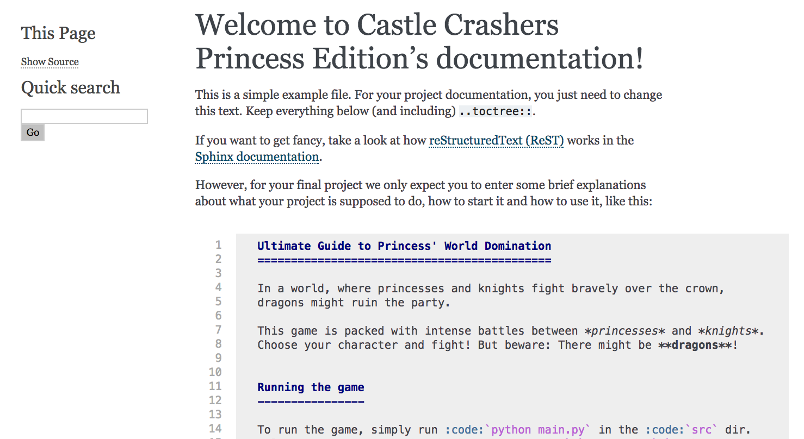

% Dates, Documentation


# Date

How do you write down a date?
How do you write it for a journal? A diary? A presentation?


# Some date examples

\tiny
(roughly "now", give or take a few minutes)
\normalsize

- Wednesday, June 14, 2017
- 14. June 2017
- 2017-06-14
- 06/14/2017
- 6/14/17
- 2017-06-14T14:17:42+02:00
- 1497442662
- 2017164
- Wednesday, June 1, 2017

Which ones can you read? Which ones do you know?


# Date ambiguity problems

08/07/06

Is this July, 8th? Or August, 7th? Or maybe July, 6th?


# Endianness

Endianness describes what the first component is:

Little endian: Day - Month - Year (e.g. Germany: 14. Juni 2017)

Middle endian: Month - Day - Year (e.g. US: 7/14/2017)

Big endian: Year - Month - Day (e.g. ISO 8601: 2017-07-14)


# Date standards

To avoid confusion, many standards for dates and times exist.

Important are:

- ISO 8601
- UNIX Timestamp
- RFC 3339
- RFC 5322

For the homework sheets we use RFC 5322. Today we will focus on ISO 8601 and Timestamps.


# Date standards

![ISO 8601 was published on 06/05/88 and most recently amended on 12/01/04. [@xkcd1179]](https://imgs.xkcd.com/comics/iso_8601_2x.png)


# When do you need dates?

"We didn't use dates so far, why should we bother?"


# Date applications

- Birthdays
- Calendars / Schedules
- Timeseries data
- Transaction management
- Identification
- Business transactions
- ...


# Dates in Python

```{ .python .exec }
import datetime

today = datetime.date.today()
print(today)
print(repr(today))
now = datetime.datetime.now()
print(now)
print(repr(now))
```


# Specific date

```{ .python .exec }
from datetime import date

bday = date(1991, 8, 21)
print(bday)
```


# Infos about dates

```{ .python .exec }
from datetime import date

bday = date(1991, 8, 21)
print(bday.weekday())
print(bday.isoweekday())  # Wait, what day is it now?
```

::: notes

`weekday()` starts with Monday as 0, the ISO standard (`isoweekday()`) with Monday as 1. So this is Wednesday.

:::


# Formatting outputs

There are a lot of formatting options[^formats]:

\scriptsize

```{ .python .exec }
from datetime import datetime

now = datetime.now()
print(now)
print(now.strftime('%a, %d. %b %Y'))
print(now.strftime('%c'))
print(now.strftime('%Z %X %f %j'))  # What?
```

\normalsize

[^formats]: https://docs.python.org/3.6/library/datetime.html#strftime-and-strptime-behavior

::: notes

`strftime` can be remembered as "**str**ing **f**ormat of **time**".

The weird ones are:

- %Z: Timezone. Not present here.
- %X: The current time.
- %f: The current milliseconds.
- %j: The current day of the year.

:::


# Formatting rules

The formatting rules follow the standards of the programming language C.

\small

Format Meaning             Example
------ ------------------- ----------------------
%Y     4-digit year        1991, 2017
%y     2-digit year        91, 17
%m     2-digit month       01, 10, 12
%b     Abbreviated month   Mar, Aug
%B     Month               March, April (oh! You might see "März")
%H     Hours (24 h)        08, 12, 16
%M     Minutes             09, 14, 34
%S     Seconds             04, 43, 59
%a     Abbreviated weekday Mon, Tue
%c     Locale default      Tue Jun 13 20:54:04 2017

\normalsize

::: notes

This list is not exhaustive, it just contains some important ones.

*Locale* can be roughly seen as you computers language and location settings.

:::


# Formatting rules example: Locale

Try it out!

```{ .python .exec }
from datetime import datetime

print(datetime.now().strftime('%c'))
```

Use `strftime(...)` to create the same output as `%c` did here. (You can try your own at home, if it differs)


# Formatting rules example: Locale

```{ .python .exec }
from datetime import datetime

now = datetime.now()
print(now.strftime('%c'))
print(now.strftime('%a %b %d %H:%M:%S %Y'))
```


# Formatting rules example: Locale

```{ .python .exec }
from datetime import datetime
import locale

locale.setlocale(locale.LC_ALL, 'de_DE')

now = datetime.now()
print(now.strftime('%c'))
print(now.strftime('%a %b %d %H:%M:%S %Y'))
```


# Formatting rules example: ISO Time

An ISO 8601 time looks like this:

`2017-10-02T08:12:34`

Can you create a format to print the date and time like this?


# Formatting rules example: ISO Time

```{ .python .exec }
from datetime import datetime

print(datetime.now().strftime('%Y-%m-%dT%H:%M:%S'))
```


# ISO formatting

```{ .python .exec }
from datetime import datetime

someday = datetime(2015, 7, 28, 21, 32, 12)
print(someday.isoformat())
```


# Switching sides -- date parsing

Last week's homework discussed string parsing. For dates we can do the same:

```{ .python .exec }
from datetime import datetime

parsed = datetime.strptime('Wed Jun 14 14:47:12 2017',
                           '%a %b %d %H:%M:%S %Y')

print(parsed.isoformat())
```

::: notes

Analogue to `strftime`, `strptime` stands for **str**ing **p**arse **time**.

:::


# Calculating with dates

- How many minutes are between 14:35 and 17:22?
- How many days are between 2000-02-28 and 2000-03-01?
- How many days are between 2100-02-28 and 2100-03-01?
- What date is 231 days from now?
- How many weeks are between 2017-04-03 and 2017-07-08? (i.e. how many lectures do we have?)


# Calculating with dates

- How many minutes are between 14:35 and 17:22?

```{ .python .exec }
from datetime import datetime

# datetime.time does not allow math, so we use datetime
a = datetime(2017, 6, 14, 14, 35)
b = datetime(2017, 6, 14, 17, 22)
print(b - a)
```


# Calculating with dates

- How many days are between 2000-02-28 and 2000-03-01?
- How many days are between 2100-02-28 and 2100-03-01?

```{ .python .exec }
from datetime import datetime

a, b = datetime(2000, 2, 28, 23, 59), datetime(2000, 3, 1)
c, d = datetime(2100, 2, 28, 23, 59), datetime(2100, 3, 1)

print((b - a).days)  # leap year
print((d - c).days)  # no leap year
```


# Calculating with dates

- What date is 231 days from now?

```{ .python .exec }
from datetime import datetime, timedelta

now = datetime.now()
days231 = timedelta(days=231)
print(now + days231)
```


# Calculating with dates

- How many weeks are between 2017-04-03 and 2017-07-08? (i.e. how many lectures do we have?)

```{ .python .exec }
import math
from datetime import datetime, timedelta

begin = datetime(2017, 4, 3)
end = datetime(2017, 7, 8)

print(math.ceil((end - begin) / timedelta(weeks=1)))
```


# Other date formats

Humans use other date formats quite often:

- tomorrow
- 5 minutes ago
- next week
- Saturday

We can not easily parse these with `datetime`.


# Other date formats

`pip install parsedatetime` installs a neat library for this.

```{ .python .exec }
import parsedatetime as pdt

cal = pdt.Calendar()
time_struct, parse_status = cal.parse("tomorrow")

print(time_struct)
print(parse_status)
```


# Other date formats

```{ .python .exec }
import parsedatetime as pdt

cal = pdt.Calendar()
time_struct, parse_status = cal.parse("hello")

print(time_struct)  # now
print(parse_status)  # unsuccessful
```


# Other date formats

\scriptsize

```{ .python .exec }
from datetime import datetime
import parsedatetime as pdt

cal = pdt.Calendar()
min5 = cal.parse("5 minutes ago")[0]
nweek = cal.parse("next week")[0]
saturday = cal.parse("saturday")[0]

print(datetime.now().isoformat())
print(datetime(*min5[:6]).isoformat())
print(datetime(*nweek[:6]).isoformat())
print(datetime(*saturday[:6]).isoformat())
```

\normalsize


# Measuring times

In many cases we don't need full dates:

- Program execution times
- Download times
- Racing times
- ...


# `time` module

```{ .python .exec }
import time

print(time.time())
```


# `time.time()`

`time.time()` gives UNIX timestamps in seconds

```{ .python .exec }
import time

print(time.time())
```

::: notes

The seconds are exact, everything in between depends on the system. However,
for most things that's enough.

:::


# UNIX timestamp

The UNIX time (or POSIX time) starts at

> January 1st, 1970, 00:00:00 UTC

`time.time()` tells us how many seconds passed since then[^leaps].

[^leaps]: Almost. There's a concept of leap seconds which is not accounted for
in Python. Check out https://youtu.be/-5wpm-gesOY for entertaining info.


# Execution time

Most commonly we use `time.time()` to measure execution times.

```{ .python .exec }
import time

start = time.time()
time.sleep(.3)  # do something (here: nothing)
end = time.time()

print(end - start)
```

::: notes

Important applications are: download times, complex computations, simulations, computer games, ...

`time.sleep(...)` lets your program sleep for roughly the number of seconds passed to it.

:::


# Benchmarking functions

```{ .python .exec }
import timeit

print(timeit.timeit("123 + 456"))
```

::: notes

timeit runs your function multiple times and calculates some statistics about it.

This can help you figure out which functions are fast, which ones are slow, etc.

:::


# Benchmarking functions

```{ .python .exec }
import timeit

def add(a, b):
    return a + b

print(timeit.timeit("add(123, 456)",
                    setup="from __main__ import add"))
```

::: notes

It requires a little bit more work to test your own functions: You need some *setup* to import them.

:::


# Benchmarking functions

You can also run the timeit tool from the command line:

```{ .bash }
python -m timeit '123 + 456'
```

*Output:*

```{ .changelog }
100000000 loops, best of 3: 0.0128 usec per loop
```

::: notes

Measure the time 100,000,000 times (sometimes fewer, it makes assumptions about
how many iterations are reasonable) and returns the average of the best three
runs.

:::


# Enough of dates and times

Let's talk a little bit about the final projects!


# Final projects: meta data

- Count as much as three sheets! In theory:
    - Project proposal / idea
    - Implementation
    - Documentation
- Partial grading possible (e.g. proposal and implementation but no docs)
- Submission is 2017-07-05T14:15:00+02:00
    - Last lecture, so that you can present your results
- Should be small projects, orient yourself at the amount of work we did for
  the homework.
- Freestyle! Choose your own topic!


# Final projects: requirements

- Demonstrate what you learned: use functions, maybe classes, structure your
  code
- If you want, use a new python package we did not cover
- Write documentation for critical functions
- Write documentation for the project proposal (more in a couple of slides)


# Final projects: Project structure

\dirtree{%
.1 crashers (rename this).
.2 docs.
.3 conf.py.
.3 index.rst.
.3 modules (created on build).
.3 \_templates.
.3 \_static.
.3 Makefile.
.3 make.bat.
.2 src.
.3 code files and dirs.
}

::: notes

The `src` directory is the heart of your project. Here will all your modules, packages, etc. be.

The `docs` directory is reserved for the documentation. We will have to do some minor adjustments here.

:::


# Final projects: Kickstart

Rename the `crashers` directory to something suiting your project. A codename,
your group name, ...

This is your project folder now. At the end, just zip it and submit it!


# Final projects: Documentation



::: notes

We will use Sphinx for the documentation.

`pip install sphinx`

:::


# Final projects: Documentation

Change the `docs/conf.py` here:

```{ .python }
project = 'Castle Crashers Princess Edition'
author = 'Sebastian Höffner, Aline Vilks'
```


# Final projects: Documentation

To build the documentation, navigate to the `docs` directory and type:

```{ .bash }
make html
```

::: notes

This may or may not work properly now. If you have any troubles you can't
solve, talk to us!

:::


# Final projects: Documentation

To view it, navigate to `docs/_build/html` and type:

```{ .bash }
python -m http.server 8080
```

Then bring up your browser and open http://localhost:8080

::: notes

This can differ for older Python versions. Come to us with any problems!

:::


# Final projects: Documentation

\scriptsize

To change what you see, adjust the `index.rst` inside the `docs` directory.
Then rebuild (`make html`) the documentation!

**Adjusting the `index.rst` is part 1 of your projects!**

\tiny

```{ .rest }
   Ultimate Guide to Princess' World Domination
   ============================================

   In a world, where princesses and knights fight bravely over the crown,
   dragons might ruin the party.

   This game is packed with intense battles between *princesses* and *knights*.
   Choose your character and fight! But beware: There might be **dragons**!


   Running the game
   ----------------

   To run the game, simply run :code:`python main.py` in the :code:`src` dir.
   Select a princess or a knight by typing :code:`p` or :code:`k`. Then use
   :code:`s` and :code:`w` for strong and weak attacks, respectively. Fight
   through your opponents until you conquer the crown!

   .. toctree::
      :maxdepth: 2

      modules/modules
```

\normalsize


# Final projects: Documentation -- ReST

\scriptsize

```{ .rest }
Titles are underlined
=====================

**Bold fonts**
*italic fonts*

Subtitle
--------

:code:`inline code`

.. code-block:: python

   print('Hello World!')

This is `a link`_ in a sentence.

.. _a link: http://localhost:8080
```

\normalsize

::: notes

There's much much more to ReST, but these are the most important things you will need.

You can try out (some) things at http://rst.ninjs.org/ .

:::


# Final projects: Documentation -- Sphinx ReST

Sphinx provides some extensions. Keep this in your file:

```{ .rest }
   .. toctree::
      :maxdepth: 2

      modules/modules
```

It creates a navigation to the module documentations.


# Final projects: Documentation

Remember to use google style doc comments[^styleguide]:

\tiny

```{ .python }
class SampleClass(object):
    """Summary of class here.

    Longer class information....
    Longer class information....

    Attributes:
        likes_spam: A boolean indicating if we like SPAM or not.
        eggs: An integer count of the eggs we have laid.
    """

    def __init__(self, likes_spam=False):
        """Inits SampleClass with blah."""
        self.likes_spam = likes_spam
        self.eggs = 0

    def public_method(self):
        """Performs operation blah."""
        ...
```

\normalsize

[^styleguide]: Example taken from https://google.github.io/styleguide/pyguide.html#Comments


# Final projects: Ideas

If you don't have any ideas, check out the document we uploaded or seek us out.


# Final projects: Main guideline

\Huge

Have fun!

\normalsize


# Appendix: Useful resources about dates and times

- Current Time: https://time.is/
- Time converter: https://www.epochconverter.com/
- Time converter: http://coderstoolbox.net/unixtimestamp/
- ISO 8601: https://en.wikipedia.org/wiki/ISO_8601


# References

