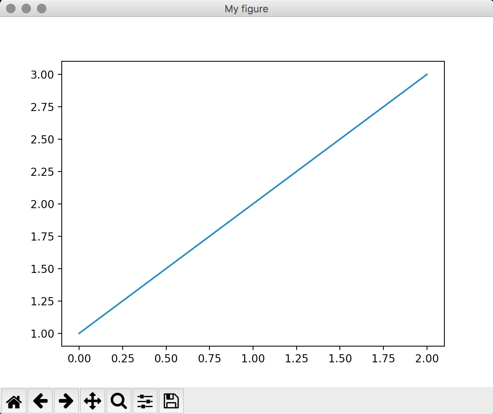

% Plotting


# First things first

You should have received an email about the course evaluation. You can either
do it at home or now!

Here is the link:

https://lehreval.psycho.uni-osnabrueck.de/evasys/indexstud.php

It is very valuable and important for me, so please take the time to answer it.


# Plotting

```{ .python .exec .plt .hideimports }
import matplotlib.pyplot as plt

plt.plot([1, 2, 3])
```


# Plotting libraries

- `ggplot`:  http://ggplot.yhathq.com
- `matplotlib`: https://matplotlib.org
- `vtk`: http://www.vtk.org

\note{
- ggplot is close to R's ggplot2 library
- matplotlib started out as a project to mimic MATLAB's plotting capabilities
- vtk is a library for 3D plots

We focus on matplotlib.
}


# Plotting data

```{ .python .exec .plt }
import matplotlib.pyplot as plt

y = [x ** 2 for x in range(5)]
plt.plot(y)
```

*Important*: You need to call `plt.show()` at the end!

\note{
If you only supply one argument to `plot()`, it uses x from `0` to `N - 1` and
assumes the data as `y` values.

For my automatic slide generation I had to leave out the call to `plt.show()`,
which actually brings up the figure where we plot to. You have to add it
whenever you want to see what you plotted. (There's an exception called "interactive mode", which allows you to play around with plots more natural. You can enable it with `plt.ion()`.)
}


# Plotting data

```{ .python .exec .plt }
import matplotlib.pyplot as plt

x = range(-4, 5)
y = [i ** 2 for i in x]
plt.plot(x, y)
```


# Adding labels

```{ .python .exec .plt .hideimports }
import matplotlib.pyplot as plt

x = range(-4, 5)
y = [i ** 2 for i in x]
plt.plot(x, y)
plt.xlabel('x')
plt.ylabel('$x^2$')
```

\note{
Please note that for space reasons I remove the imports from now on. It's `import matplotlib.pyplot as plt`.

`pyplot` (which is our `plt`) always refers to the last active plot when making changes. We will see later, why this is important.

Matplotlib supports LaTeX math formulae for many labels, e.g. titles.
}


# Adding labels

```{ .python .exec .plt .hideimports }
import matplotlib.pyplot as plt

x = range(-4, 5)
y = [i ** 2 for i in x]
plt.plot(x, y)
plt.title(r'$x \rightarrow x^2$')
```


# Adding multiple lines

```{ .python .exec .plt .hideimports }
import matplotlib.pyplot as plt

x = range(-4, 5)
y1 = [i ** 2 for i in x]
x2 = [i for i in x if i != 0]
y2 = [1 / i for i in x2]

plt.plot(x, y1, x2, y2)
```


# Getting a data set

Iris Data set [@fisher1936]:

```{ .python wd=12_Plotting/code }
import requests
with open('iris.data', 'w') as iris:
    iris.write(requests.get(
        'https://archive.ics.uci.edu/ml/' +
        'machine-learning-databases/iris/iris.data'
        ).text)
```


# Reading iris data

\scriptsize

```{ .python wd=12_Plotting/code file=iris_reader.py .exec .hideimports }
```

\normalsize

\note{
I will use this `iris_reader` on the following slides to get the data for the plots.

You can also use it to tag along.
}


# Plotting iris data

```{ .python wd=12_Plotting/code .exec .hideimports .plt }
import matplotlib.pyplot as plt
from iris_reader import get_data

y = [i['sepal_length'] for i in get_data()]
plt.plot(y)
plt.ylabel('sepal length')
```

\note{
It makes not much sense to just plot the sepal lengths. Let's plot it in relation to something.
}


# Plotting iris data

\small

```{ .python wd=12_Plotting/code .exec .hideimports .plt }
import matplotlib.pyplot as plt
from iris_reader import get_data

data = get_data()
x = [i['sepal_length'] for i in data]
y = [i['sepal_width'] for i in data]
plt.plot(x, y)
plt.xlabel('sepal length')
plt.ylabel('sepal width')
```

\normalsize

\note{
This still doesn't seem right, what should we change?
}


# Scatter plots

\small

```{ .python wd=12_Plotting/code .exec .hideimports .plt }
import matplotlib.pyplot as plt
from iris_reader import get_data

data = get_data()
x = [i['sepal_length'] for i in data]
y = [i['sepal_width'] for i in data]
plt.plot(x, y, 'x')  # changing "line" style
plt.xlabel('sepal length')
plt.ylabel('sepal width')
```

\normalsize


# Default scatter plots

\small

```{ .python wd=12_Plotting/code .exec .hideimports .plt }
import matplotlib.pyplot as plt
from iris_reader import get_data

data = get_data()
x = [i['sepal_length'] for i in data]
y = [i['sepal_width'] for i in data]
plt.scatter(x, y)
plt.xlabel('sepal length')
plt.ylabel('sepal width')
```

\normalsize

# Multiple data rows

\scriptsize

```{ .python wd=12_Plotting/code .exec .hideimports .plt }
import matplotlib.pyplot as plt
from iris_reader import get_data

data = get_data()
for c in ['Iris-setosa', 'Iris-virginica', 'Iris-versicolor']:
    x = [i['sepal_length'] for i in data if i['class'] == c]
    y = [i['sepal_width'] for i in data if i['class'] == c]
    plt.scatter(x, y)
plt.xlabel('sepal length')
plt.ylabel('sepal width')
```

\normalsize


# Adding a legend

\scriptsize

```{ .python wd=12_Plotting/code .exec .hideimports .plt }
import matplotlib.pyplot as plt
from iris_reader import get_data

data = get_data()
for c in ['Iris-setosa', 'Iris-virginica', 'Iris-versicolor']:
    x = [i['sepal_length'] for i in data if i['class'] == c]
    y = [i['sepal_width'] for i in data if i['class'] == c]
    plt.scatter(x, y, label=c)
plt.legend()
```

\normalsize

\note{
You can move the legend around using the keyword `loc`, e.g. to `'center right'` or `'lower center'`.
}


# Changing colors

\scriptsize

```{ .python wd=12_Plotting/code .exec .hideimports .plt }
import matplotlib.pyplot as plt
from iris_reader import get_data

data = get_data()
for cl, co in zip(['Iris-setosa', 'Iris-virginica', 'Iris-versicolor'],
                  ['r', 'g', 'b']):
    x = [i['sepal_length'] for i in data if i['class'] == cl]
    y = [i['sepal_width'] for i in data if i['class'] == cl]
    plt.scatter(x, y, color=co)
```

\normalsize


# Linear regression

Let's try to figure out how the sepal width depends on the sepal length for the Iris setosa.

We can do this with a simple linear regression:

\begin{align}
    y &= \beta x + \alpha \\
    \hat\beta &= \frac{\sum\limits_{i=1}^n \left(x_i - \bar x\right)\left(y_i - \bar y\right)}
                  {\sum\limits_{i=1}^n \left(x_i - \bar x\right)^2} \\
    \hat\alpha &=\bar y - \hat\beta\,\bar x
\end{align}


# Linear regression

\scriptsize

```{ .python .exec wd=12_Plotting/code file=12_Plotting/code/lin_reg.py }
```

\normalsize


# Linear regression

\small

```{ .python wd=12_Plotting/code .exec .hideimports .plt }
import matplotlib.pyplot as plt
from iris_reader import get_data
from lin_reg import linear_regression

data = get_data()
x = [i['sepal_length'] for i in data if i['class'] == 'Iris-setosa']
y = [i['sepal_width'] for i in data if i['class'] == 'Iris-setosa']
a, b = linear_regression(x, y)
plt.scatter(x, y)
x = [i * 0.1 for i in range(40, 60)]
y = [a + b * xi for xi in x]
plt.plot(x, y, 'r')
```

\normalsize

\note{
You can draw multiple plots into one "plot".
}


# Subplots

\scriptsize

```{ .python wd=12_Plotting/code .exec .hideimports .plt }
import matplotlib.pyplot as plt
from iris_reader import get_data

data = get_data()
x1 = [i['sepal_length'] for i in data if i['class'] == 'Iris-setosa']
y1 = [i['sepal_width'] for i in data if i['class'] == 'Iris-setosa']
x2 = [i['sepal_length'] for i in data if i['class'] == 'Iris-versicolor']
y2 = [i['sepal_width'] for i in data if i['class'] == 'Iris-versicolor']

plt.subplot(1, 2, 1)
plt.scatter(x1, y1)
plt.subplot(1, 2, 2)
plt.scatter(x2, y2)
```

\normalsize


\note{
You can also specify subplots to span multiple "cells", but it gets tricky.
E.g. a subplot which spans the second row would look like this: `plt.subplot(2,
1, 2)` (2 rows, 1 column, second position).
}


# Figure objects

\scriptsize

A figure surrounds the whole plotting environment.

```{ .python wd=12_Plotting/code .hideimports }
import matplotlib.pyplot as plt
plt.figure('My figure')
plt.plot([1, 2, 3])
```

\normalsize

{ height=200px }

\note{
This does not work well with the auto slide creation, hence I included a screenshot.

The name `My figure` does not only set the title, it is also a unique
identifier to reactivate the figure.
}


# Using a figure window


From left to right:

- Home view (reset views, return to initial view)
- Previous view
- Next view
- Pan (move around the plot)
- Zoom (zooms to a user drawn rectangle)
- Subplot Configuration Tool (allows to change e.g. margin around plots)
- Save (save the plot as png)

\note{
Depending on the "backend" your matplotlib uses, these might be slightly
different in style or behavior.

A backend is, in a simplified fashion, the software your matplotlib uses to
create windows and draw into them. There are also backends which can only
create file outputs.
}


# Parts of a Figure

{ height=240px }

\note{
Everything inside the window is the `canvas`, the most important part of the figure.

All elements you can see here (except for "figure") are drawn onto the canvas.
}


# References
