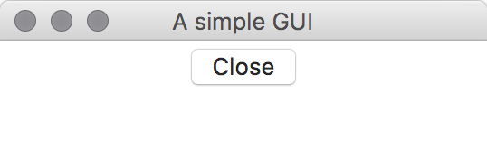
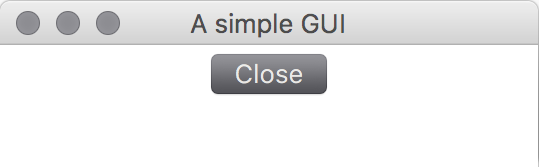

% GUI -- What next?


# User interfaces

How does the user interact with your code?

- Command line interface (CLI)
- Graphical user interface (GUI)

There are many more fine-grained definitions and notions!


# Command line interfaces

- Issue command after command
- Mostly used inside the terminal
- Examples: Shell, Python, Text adventures, ...


# Graphical user interfaces

- Event driven
- Render windows, buttons, etc.
- Examples: spyder, webbrowsers, office programs...


# GUI: Event driven

\begin{tikzpicture}[->,node distance = 4cm, auto, thick]
    \tikzstyle{every state}=[fill=blue!10,draw=black,rectangle]
    \node [state] (register) {register listeners};
    \node [state,right of=register] (eventcheck) {any events?};
    \node [state,right of=eventcheck] (notify) {notify listeners};
    \draw (register) edge (eventcheck)
            (eventcheck) edge [bend right] node {yes} (notify)
            (notify) edge [bend right] (eventcheck)
            (eventcheck)  edge [loop above]  node {no} (eventcheck);
\end{tikzpicture}


# GUI: Event types

What events do you think can happen?


# GUI: Event types

- Keyboard inputs/Mouse Inputs
- Opening, Closing, Minimizing, Maximizing
- Screen updates
- Calculation results
- ...

$\Rightarrow$ High complexity and flexibility needed!


# GUI: Redraw

GUIs need to redraw changes, e.g. a button press:

{width=150}{width=150}


# GUI: Redraw demo

\scriptsize

```{ .python file=code/button_only.py }
```

\normalsize


# What next?

- threading
- inheritance
- numpy
- project euler and similar programming puzzles
- other reads
- classes
- databases
- different programming languages

# References
